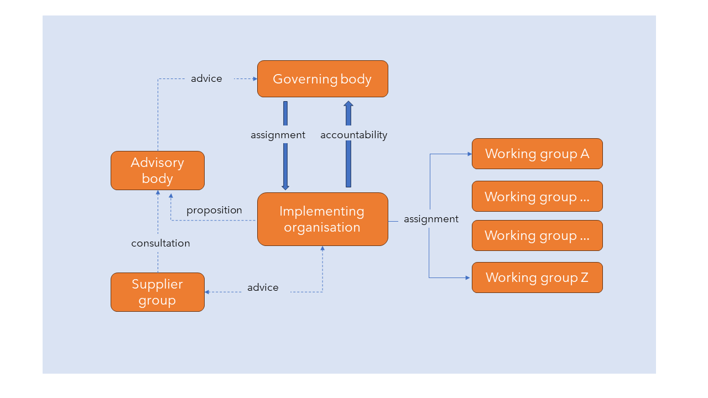
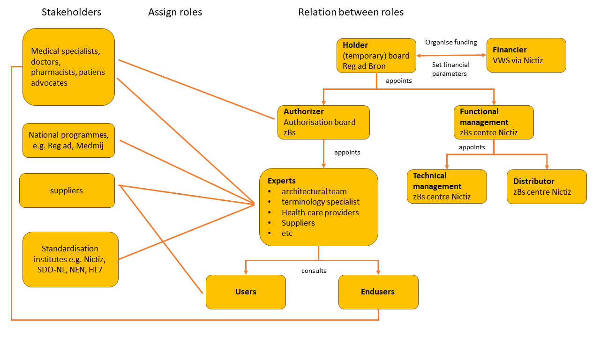
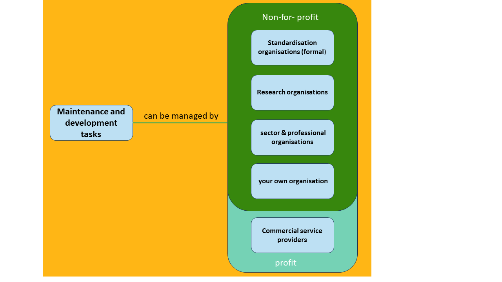
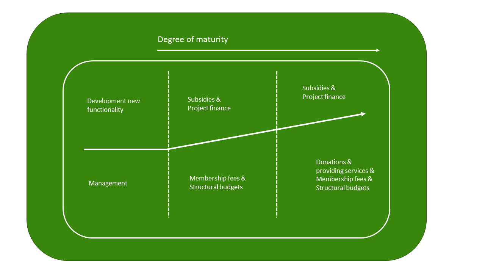
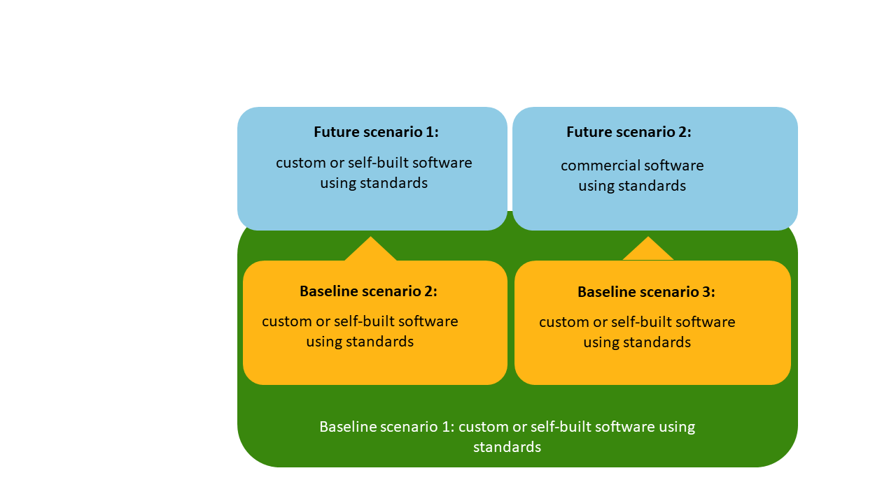
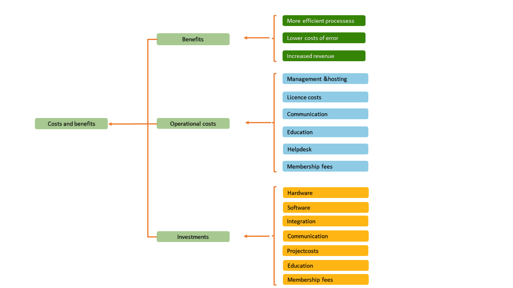

# Strategy
 This section looks in more detail at subjects related to strategic subjects from the Management and Development Model.

## The development and management organisation (Activity Governance) 
This activity includes laying down policy on your own administrative organisation (such as the legal form); the bylaws (charter) and forming alliances with other organisations. The regulation of the decision-making process is crucial.

### Organisation structure 
The BOMOS activities diagram summarises the various activities that can take place in a standardisation community. The [Figure below](#fig-organisatiesmodel) illustrates the outline organisation structure. One key starting point is the division between substantive activities in the implementing organisation and decision making by the governing body.

It is the task of the governing body to commission a (not-for-profit) implementing organisation that is responsible for the majority of the management tasks. The governing body brings together the needs in terms of management expressed by its grassroots and has the mandate on behalf of those grassroot players to reach decisions on issues relating to the standards in question. The governing body and implementing organisation preferably work together with a single contact point at each organisation. The governing body is primarily charged with the task of ‘decision making’. In practice, the governing body meets a couple of times a year, a fact that should not obstruct the desired decision-making process. The governing body must grant the implementing organisation sufficient mandate. In practice we do see certain decisions being submitted to members of the governing body in writing (email) for approval or that the responsibility for specific activities (for example communication) is entrusted to a single member. This makes it easier to hold bilateral discussions between the implementing organisation and the member of the governing body who is responsible and to reach interim decisions (this approach can also serve as an alternative for the single contact point at each organisation).

The essence is that there must be a clear record of which decisions have to be taken at a meeting of the governing body; which can be submitted in writing (email) and which can be taken by a specific member of the governing body, and for which decisions the mandate lies with the implementing organisation. In practice, annual plans are often used for the formulation of the assignment awarded by the governing body to the implementing organisation. On the basis of reports about the annual plan, the implementing organisation is then accountable to the governing body. The annual plan describes the tasks that need to be undertaken; which working groups are in place or need to be established, and what the objectives of the working groups are, etc. The annual plan is approved by the governing body, which effectively makes it the assignment to be awarded to the implementing organisation. The Management and Development Model can be used as a framework within which the tasks in the annual plan are placed. The annual plan also makes it possible to reach agreements on the tasks to be outsourced. The actual development of standards takes place in the working groups which include in their membership actual users of the standards. The working groups are coordinated by the implementing organisation. In many cases, the actual elaborations are drawn up by the implementing organisation on the basis of discussions in the working groups. The product of the working group, a new version of a standard, can be adopted by the governing body and published as a new version. The decision-making process, who (governing body/working group) decides what must be clearly laid down.

<aside class="example" title="Information Model External Safety Risks"> 
The Information Model External Safety Risks (IMEV) contains agreements on the digital structure in which government authorities record data regarding the storage, transport and use of hazardous substances. All these data are brought together in the Register of External Safety Risks under the auspices of the Ministry of Infrastructure and Water Management. Maps then show where the external safety risks apply. Since 2021, Geonovum has been responsible for managing the IMEV on behalf of the Ministry of Infrastructure and Water Management. The new BOMOS elaboration has helped both Geonovum and its commissioning parties to arrive at a clear picture of the organisation structure. The advisory group appointed at the end of 2022 operates in accordance with this structure and at the start of 2022 adopted the guideline for future changes to the IMEV, the change protocol. 
</aside>

Ideally, a distinction is made between the different weights of changes in standards, so that the lightest (least far-reaching) changes can be dealt with by the appropriate working group or implementing organisation itself, and only the most fundamental changes require the involvement of the governing body, up to the level of the governing body decision. A working group that is continuously overruled by the governing body is unworkable.

It is possible to establish an advisory body to support the governing body with solicited and unsolicited advice. The product of a working group in that case will be submitted to the advisory body as a proposal and the advisory body will advise the governing body on the issue. The advisory body should preferably consist of independent and undisputed experts and can be a means of reinforcing independence and expertise. It is essential that these experts be selected on the basis of knowledge and experience and not on the basis of the interests or representation of an organisation; after all, all that is required of them is to provide substantive advice. The representation of interests is already established within the governing body.

Typically, the category-based demarcation of working groups in terms of the content of their work will take place along the following (layered) lines: 
* Architecture.
* Processes/services
* Data/information/messages.
* Technical standard/transaction standard.
* Security.

Another common approach to demarcation is based on the problem domain. SETU (Dutch foundation for electronic transactions in the staffing industry) for example worked with two working groups, namely Mediation and Processing. The Mediation working group is responsible for standards from requests for offers through to the placement of a temporary employee, while the scope of the Processing working group involves the standards from placement through to invoicing. In practice, for more complex standards, specific categories of working groups (e.g. ‘data’) will be further subdivided into working groups for each problem domain (e.g. ‘invoicing’), resulting in a combination of the demarcation approaches.

<aside class="example" title="SETU organisation structure">
At SETU, the organisation structure is as follows: The governing body consists of representatives of temporary employment agencies. They hold a meeting four times a year. 

At the meetings, the implementing organisation, currently made up of employees of [TNO](https://www.tno.nl/en)  and the [ABU](https://www.abu.nl/), report on the progress of the work undertaken for SETU. All work is listed in the annual plan, which is adopted before the start of each calendar year, including the allocated budgets. This work also includes organising the working groups. Working groups can include representatives from temporary employment agencies, providers of  temporary employees and suppliers. Current working groups are the working group on Planning Data, responsible for developing the SETU Standard for Planning & Scheduling, and the working group Trends & Developments, which identifies the changes and needs in the sector which have a (potential) impact on digitalisation and data exchange. There is no supplier group or advisory body at SETU. 
</aside>

One group that deserves special attention is the suppliers. For non-profit management organisations this is often a tricky issue. Although crucial for the success of a standard (without correct implementation there can be no working standard), suppliers can also have conflicting interests. In principle, suppliers can contribute to the standard as simple participants and fulfil roles in the working groups, right through to participating in the governing body. Practice has for example shown that in many cases software suppliers make very valuable contributions to the working groups, and as such it is highly recommended that suppliers be given access to the working groups. There is often a fear that suppliers will impose too much of a stamp on the standard. One option as indicated in the  [above figure](#fig-organisatiesmodel) is a separate supplier group. On the one hand this offers suppliers a platform while on the other hand keeping them out of the working groups and governing body. In this situation, software suppliers are united in a supplier group, which can advise the implementing organisation and consult with the advisory body.

Decision making within the working group can be dependent on the possible participation by suppliers and on the attitude of the suppliers. In practice, the decision on the level of influence will depend on the way in which the community is organised; if the development of the standard is driven by the interests of the software suppliers, they will (want to) exercise a greater influence on ‘their’ standard. If the development is driven by the needs of a (government) user, then this party will (want to) exercise a greater influence.

The figure offers a simplified basic structure from the governing body, implementing organisation and working groups. Alternatively, an advisory body and/or supplier group can be added. In addition to these suggested possibilities, there are numerous other alternatives, both more simple and more complex. Whatever structure you choose, the reports of the various forums should preferably be made public.

### Roles and activities 
[Part 1  describes the necesarry roles in the Management and Development Model](https://logius-standaarden.github.io/BOMOS-Fundament/en/index.html#Activities-and-Roles),and linked to the main activities of BOMOS. We will now look in more detail in the opposite direction. Starting with the roles, the table below identifies the BOMOS activities in which they are involved; this also demonstrates that a 1-on-1 connection between role and activity cannot work.

| Role | BOMOS activity |
|-----|------------------|
| Holder | Governance    |
|        | Vision         |
|        | Rights policy |
|        | Adoption and recognition (policy)|
|        | Training (policy)          |
|        | Quality policy benchmarking (policy) |
|        | Community (adoption) |
|        | Complaint handling     |
|        | Implementation support (policy) |
| Financier | Financing |
| Authoriser | Architecture (adoption) |
|             | Initiation (decision making) |
| Expert | Architecture (implementation and advice) |
|        | Initiation (advice) |
| Functional manager | Community (implementation) |
|                       | Quality policy benchmarking (implementation) |
|                       | Initiation (process) |
|                       | Wishes and requirements |
|                       | Development |
|                       | Implementation |
|                       | Documentation|
|                       | Implementation support (implementation) |
| Technical manager   | Contributes to operational aspects |
| Distributor | Promotion |
|              | Publication |
| User  | Consulted on operational aspects |

<aside class="note">

<b>Roles and stakeholders in the healthcare sector</b>

The healthcare domain is a complex situation with stakeholders and parties all of whom have an interest in the development of standardisation. By establishing relationships between the roles and the way in which those roles are implemented with the names of the stakeholders/parties, a clear insight is created into the world of this healthcare standard. (source example: NEN 7522-2021)

</aside>

### Management tasks in implementation

For the way in which management tasks are developed in an organisation structure, there are a number of different possibilities ranging from entrusting them to a standardisation organisation through to fully developing the structure within your own organisation. Creating and managing your own development organisation for every standard is not a goal in and of itself. Practice shows that few existing organisations are equipped to fulfil the complete package of tasks so that many standardisation communities have in fact decided to create their own organisation. A number of the tasks are then entrusted to their own organisation, but a number of other tasks can be entrusted to other types of organisations. The [figure below](#fig-beleggen-van-ontwikkeltaken_EN) lists other standardisation organisations, research organisations and sectoral organisations.

The model makes a distinction between not-for-profit and profit-making organisations. This distinction is relevant in the framework of openness 
([see section openess](#de-open-invulling-van-een-standaard-activiteit-community_EN)). If the management of a standard is entrusted to a profit-making organisation, then by definition that open standard cannot be open! This does not mean that commercial organisations are unable to develop open standards on behalf of a governing body (organisation) or donate their standard to a not-for-profit management organisation after it has been developed. The development and management of standards need not always take place on a not-for-profit basis although a not-for-profit organisation is the most obvious choice.

The first most obvious possibility is to entrust the management tasks to formal standardisation organisations. The world of standardisation has changed compared with thirty years ago when the majority of standards were developed by these formal organisations. In the modern era, the majority of standards are developed outside the formal standardisation organisations in various forms of consortia, and the number continues to grow. We are also seeing increasingly complex collaborative ventures between standardisation organisations. This is very much the case for semantic standards. Partly this relates to the slowness of the processes within formal standardisation organisations, but mainly it is due to the lack of substantive knowledge and expertise. After all, domain knowledge is essential for semantic standards.

This does not mean that  formal standardisation organisations have no value; the opposite is indeed the case. In a number of areas, in potential they have massive added value. For example for raising the status of the standard. The NEN3610 standard, for example, was developed by Geonovum, but to give it additional status was also published as an NEN standard. Another task that can excellently be entrusted externally is secretarial support  for working groups.

Nevertheless, substantive knowledge will always have to be organised internally. Research organisations such as universities and institutes are other options to whom tasks can be entrusted. The benefit is the wealth of substantive knowledge, but there is also a risk of lack of domain knowledge or knowledge of specific use. The opposite is the case for sectoral organisations; the advantage here is the excellent domain knowledge but the downside is a lack of substantive standardisation/ICT knowledge. In many cases (semantic) standards are a bridge too far for sectoral organisations. The subject is quickly rejected as being only for boffins, which essentially is not the case; specifically for semantics, domain knowledge is of vital importance.

One option is to create your own organisation, or to call in commercial service providers. This second option flies in the face of government principles. Creating your own organisation is the most often chosen option for the core task of developing management tasks. Many domains now have their own organisations that have knowledge of both the domain and standardisation, for example Geonovum, EduStandaard, CROW, Informatiehuis Water, SETU, etc. The heart of their work involves  strategic management activities as identified in the model and to a considerable extent also tactical and operational activities. In this situation, certain activities can be easily and sometimes better outsourced.

A number of suggestions: 
[**Module development**](https://logius-standaarden.github.io/BOMOS-Fundament/en/index.html#the-subjects-from-the-model);
Module development is a risky business if you undertake it within the development and management organisation. Selecting this option makes you also a supplier and competitor to parties in the community. It is better to encourage module development outside the development and management organisation, possibly in the form of open source software. This decision can also encourage other suppliers to support the standard and/or become involved in its development. The best approach depends on the characteristics of the community.

[**Certification**](https://logius-standaarden.github.io/BOMOS-Fundament/en/index.html#de-onderwerpen-uit-het-model);
The independence of the certifying body is essential to certification. Standard practice is for the development and management organisation to draw up the assessment framework, before outsourcing the actual assessment process (based on the assessment framework) to external parties specifically specialised in assessment and certification.

[**Architecture/Roadmapping/Benchmarking**](https://logius-standaarden.github.io/BOMOS-Fundament/en/index.html#de-onderwerpen-uit-het-model);
Support and implementation of these aspects are ideal for a research organisation in the broadest sense (in addition to knowledge institutions, also such organisations as Statistics Netherlands (CBS) for benchmarking). In particular when it comes to benchmarking, it is better to entrust this task to an external organisation.

[**Communication**](https://logius-standaarden.github.io/BOMOS-Fundament/en/index.html#de-onderwerpen-uit-het-model);
Often appropriate for a sectoral organisation that has already established a communication structure. It goes without saying that there must also be a sectoral organisation that ties in seamlessly with the standard and that is willing to include communication as a core task. Communication regarding the management and development process for a standard demands specific knowledge of that management and serves a specific target group such as software suppliers. This fact must be recognised by a sectoral organisation. Other options are communication departments of other partner organisations.

At primary level, therefore, we can conclude that the choice is to entrust the development and management tasks to:
1. Existing organisations.
2. New organisations.
3. A combination of both.

Entrusting all tasks to an organisation may sound the ideal situation, but there is no single organisation equipped to independently fulfil the complete package of tasks. Even organisations like NEN, Standardisation Forum, etc. are not equipped for this role.

In practice this often means it is necessary to create a new organisation if there is not yet any organisation in place that focuses on standardisation within the domain. Option 3, the combination of the two means that certain tasks can be taken up by this (new) specific domain standardisation organisation while other tasks can be dealt with by other types of organisations as described in this section on the outsourcing of tasks.

<aside class="example" title="Edustandaard">
Edustandaard is a platform that brings together all public and private parties within the field of education, as the place for reaching agreements. These agreements relate for example to improving the findability of digital learning material or transferring student data from one system to another. Edustandaard supports public and private chain parties in education by providing standards and reference architectures aimed at organising information flows in the education chains as effectively as possible. Edustandaard manages a series of standards and provides an overview of and insight into the functioning of (chain) processes. The organisation also offers advice to chain parties in all education sectors, from primary through to further education.  
[The governance of the Edustandard is described in the annex](# todo)
.
</aside>

### The organisation form

Whether just a selection of the tasks or all tasks are to be undertaken by the new organisation, the new organisation must in all circumstances be established, according to a legal form. There are many different legal forms for organisations in the Netherlands. The openness of the standard is an absolutely essential operating principle. The definition of openness specifies that the (decision making of the) standard must be entrusted to a not-for-profit organisation. This automatically excludes a large proportion of the possible organisation forms, leaving only a few viable options, namely:

1. Foundation.
2. Association.
3. Government organisation (as collective term).

**The foundation:** 
  A foundation is a legal entity established by notarial deed by one or more natural persons or legal entities. As a rule, its governing board has a chair, a secretary and a treasurer. The governing board is the only compulsory body within a foundation. There can also be a supervisory board that supervises the board of the foundation. Unlike an association, a foundation has no members. A foundation can have donors, but they have no say in the operation of the foundation. A foundation can also have volunteers.

<aside class="example" title="Stichting RIONED">
The standard Data Dictionary Urban Water is currently under further development, but is also under management and is used for operational purposes. Transparency and quality of management are crucial for continuity, quality and support for the standard. Stichting RIONED is committed to a careful and transparent management process with clear procedures and a transparent organisation. This ensures that suppliers and users can implement and use the standard, with confidence. The management procedures and organisation are based on the BOMOS standard and feature a programming line, an operational line and an adopting line. As with the other activities of the Stichting RIONED, all stakeholders can contribute ideas and are jointly responsible for decisions in many different ways, as required.
</aside>

**The association:** An association is a legal entity under Dutch law. An association is generally established by a civil-law notary who executes the appropriate deed. This is not necessary, but without the civil-law notary, the association has limited legal authority (the directors are jointly and severally liable). If an association is established by notarial deed, it must also have articles. These at least state the objective of the association, the obligations of the members, the convocation of the general meeting (of members) and the appointment/dismissal of the directors. As association has an objective that is aimed for. This objective may not be the distribution of profit among the members. This does not mean that no profit may be made, but any profit generated must be allocated to a specific purpose (such as the objective of the association, knowledge sharing, quality improvement, charitable acts, etc.). An association has members. These are people who are members of the association because they support the objective. Generally the members pay a contribution to keep the association running. Members can influence the policy of the association via a general meeting (of members) (AGM). Meetings of this kind are held at least once a year, and every member is invited and has voting rights. The AGM has all authorities not laid down by law or the articles, and as such is the highest body within the association.

**The government organisation:** Because of the possible variety of government organisations, a brief discussion is not possible. A government organisation could be deployed in one of several ways: a single government organisation as a management organisation for all standards related to government, or a single government organisation for each individual standard. Alternatively, a single government organisation could take responsibility for implementing the management tasks, but equally multiple government organisations could join forces. For example as an association. The choice of legal form must be taken with due care, also taking account of such issues as the simplicity of the establishment process. For foundations, one possible stumbling block is that it is difficult for government parties to take part in a foundation, and that a foundation is not permitted to have any members. With an association, a key issue is the considerable power wielded by the AGM. It is simple for a foundation or an association to demonstrate openness. For both the foundation and the association, the articles are essential; effectively, they regulate the mandate of the roles in the organisation.

Although a foundation is not permitted to have members, at HL7, the term members is used although in strict formal situations the term _associates_ is used. SETU has no members but participants. A collaborative venture without legal form can work well in practice for management, but for more practical issues can be a disadvantage because the collaborative venture as such has no authority to enter into agreements; in that situation, one of the partners will always be required to enter into the agreement in question. Possible disadvantages of this construction are the loss of identity; being bound by the rules and restrictions of the partner; less effectiveness, etc. The advantage of this form of organisation is that it is easily established and terminated, without legal consequences. The organisation structure can to a certain degree reduce or at least make explicit the non-committal nature. The non-committal nature of the participants in terms of standards is certainly a serious point for attention in the framework of a permanently applied standard.

<aside class="example" title=”The CCvD Datastandaarden">
Decision making on changes to a standard or about the strategy for a standard will generally lie with the management organisation. In certain cases, however, the strategy can be entrusted to a body operating alongside the management organisation. One example is the Central Board of Experts on Data Standards (CCvD Datastandaarden). This is a joint consultation body with stakeholders in which the Informatiehuis Water (IHW), Stichting Kwaliteitsborging Bodembeheer (SIKB) and the Stichting RIONED jointly adopt any changes to their standards and their (strategic) plans. This construction was selected because the standards and user communities overlap considerably. One standard is in fact jointly managed by SIKB and IHW. This requires the joint adoption of new versions.

New versions of standards after being adopted by the CCvD Datastandaarden are still confirmed by the boards of the management organisations. After all, the CCvD is not an _owner_ of the standards and is not able too (formally) adopt any new version or strategy. The boards of the participating management organisations are positioned above the CCvD. 
</aside>

<aside class="note">
<b>Focus also on the 'soft' facets </b>

This chapter describes the often relatively ‘hard’ structure of the organisation; the potential stumbling block is to lose sight of the ‘soft’ facets. When it comes to standardisation, these soft factors are often of vital importance to the success of a standard. Establishing a consortium in which parties trust each other and are able to cooperate constructively without every incident automatically threatening the continued existence of teh consortium is a special social and organic process. 
</aside>

<aside class="example" title="Template voor beheerdocument en rekenmodel van Geonovum">

To provide their clients with a greater insight into the activities involved in the management process of standards, Geonovum has drawn up a generic management document. This document describes what Geonovum does in each of the activity groups that make up the BOMOS model. For each standard to be managed by Geonovum, the organisation also draws up a specific management document. This specific management document contains the supplementary agreements for each standard. In essence the specific management document provides an overview of all additional and less work in relation to the generic management document.

To provide an optimum insight into the management costs, based on the generic and specific management model, Geonovum also recently developed a [BOMOS calculation model](https://www.geonovum.nl/themas/standaardisatie#Beheer) in which the required minimum effort is calculated, based on an already known and managed standard. This basic minimum is then used to make a specific estimate of any additional and less work as described in the specific management document. This enables us to arrive at a realistic and well-substantiated estimate of the management costs.

This same structure can be used by other organisations: to make use of the calculation model, they can draw up their own generic management plan and a specific management plan for each of the standards they manage. These two documents are then used as input for the accompanying calculation model.

</aside>

### Vision

Developing a substantive vision on the direction for the standard in the context: The spot on the horizon for the long term. A compact  translation for example into a fact sheet on this vision can also be extremely valuable in communication regarding the standard and promoting adoption of the standard. There must also be specific attention for innovation; many organisation use specific tools for this purpose, such as a radar or specifically a tech radar in which innovative developments are plotted on a radar screen based on time and impact. Tools of this kind are also applicable in this case. The vision for a standard is in essence no different from the vision for a business/product, etc. Hence the decision by BOMOS to not provide a specific structure for standards. The further detailing of the innovation subjects referred to in the vision will often take place at tactical level, for example as an element of the Architecture.

## Costs and revenue (Activity: Financing)

The primary objective of this particular activity is to draw up a financial model for the long term that guarantees revenue in line with demand. Developing and managing a standard is a structural expense. The amount it costs depends heavily on the context and dynamism of the standard, and it is not simple to make any generic statements on those costs. The first developments often start with projects which begin with budgets of 30,000 euro and upwards (sometimes many times greater). In addition, an initial project will not directly result in a standard (instead, it investigates the possibilities and scope of a standard, in a working group). Following this initial development, the standard must be structurally managed and further developed. There are known cases in which the management has been organised with budgets in the order of 250,000 to 900,000 euros (per year). Until now, little research has been conducted into this aspect, with the exception of the Ethernet standard: this  technical standard cost $10 million dollars to develop. Other information obtained from literature suggests that the revenue from the sale of IOS standards covers around half of the costs incurred by ISO in the development and management of its ISO standards.

### The benefits of generic standardisation

Although few figures are available, sufficient economic research has been conducted into the advantages and disadvantages of standardisation. The table below provides a summary based on Blind, K. (2004). The economics of standards; theory, evidence, policy):

|  | Positive effects | Negative effects |
| --- | --- | --- |
| Compatibility / interface | Network externalities | Monopoly |
|  | Avoiding Lock-ins |  |
|  | Increased variety of systems products |  |
| Variety reduction | Economies of scale | Reduced choice |
|  | Building focus and critical mass | Market concentration |
| Information standards | Facilitates trade | Regulatory capture |
|  | Reduced transaction costs |  |

The following are particularly relevant for (semantic) domain standards:

* Positive network effects (the value rises with the number of users).
* Preventing vendor lock-ins.
* Increased variety of products and services.
* Economies of scale.
* Lower transaction costs.

### Costs and revenue

It is nevertheless possible to examine the potential cost items and revenue for the management of standards. These are summarised in the balance sheet below.

| Debit | Credit |
|  --- |  ---  |
| Development costs | Structural budget |
| Management costs | Project financing |
| Communication | Membership fees |
| Membership costs (+ travel expenses) | Grant |
| Operational costs (accountant) | Services |
| Accommodation | Licences |
| Goodwill |  |
| Tooling (Licences) |  |
| Financing costs |  |

#### Debit

The main costs will in principle relate to staffing costs for the primary task of the organisation; the development of new functionality and the maintenance of all existing functionality in the standards. The standards are published and possibly also promoted and advertised for which communication costs will be incurred. Communication costs consist not only of staffing costs but also the costs for creating a communication platform, organising meetings, the website and for example printed material.

Specific software tools are often used, such as data modelling software, for which licence fees must be paid. Another potential cost item is participation in related standardisation organisations for which membership costs are charged. In different communities, this item can range from 0 to 15% or higher of the total budget. There are also often travel expenses for international meetings. Standard operating costs also apply such as ICT facilities (office automation), accommodation and costs for the accountant for the financial statements. Goodwill can also be considered a cost item. Goodwill comprises the investments made in the environment that do not contribute directly to the standard itself, such as attending meetings and account management. This investment often serves to receive goodwill in return from others (as a form of revenue). Finally there are financing costs which refer to activities aimed at generating income for the standardisation activities. Depending on the financing model, these may be costs for recruiting members or applying for subsidies and grants, etc.

The ratios can shift over time, for example in a particular phase of a standard it is possible to slow down the  development process, shifting the focus more towards communication aimed at promoting adoption of the standard. In line with these changes, costs will shift from development to communication.

#### Credit

Potential sources of income include stakeholders who provide money from their structural budget for the standard. Stakeholders could be a ministry, a sector or an interest group. In the same way, these organisations may provide project financing on a temporary basis for a specific project. Furthermore, because standards have both a social and an economic interest, there are often possibilities for receiving grants and subsidies. These subsidies are another potential source of income; obtaining them can however be time-consuming and restrictions may be imposed on the purpose for which the money can be spent.

Structural forms of financing are preferred to (temporary) project financing. After all, no one will want to implement a standard if it is uncertain whether it can still be managed next year, because the standard is funded with finite project financing. At the same time, structural financing is a requirement  for inclusion in the apply or explain list with open standards published by the Standardisation Forum.

Other potential sources of revenue relate to the standard itself. It is possible to ask for money for both downloading documents with specifications or linked to the use of the standard. Neither form will encourage adoption of the standard. In practice there is often resistance to paying for the standardisation document, irrespective of the amount. Nevertheless, it is the business model currently used by the NEN for its standards. Also in the framework of openness (see chapter 8), it is unwise to request payment for the  documents or use of the standard. However small the amount may be, imposing the charge will at least make the standards less open. In practice, therefore, draft versions of these standards are often used, because in that form they can still be distributed free of charge. Another possibility is services related to the standard. For example consultancy about the standard or implementation consultancy. For example offering services in the form of a central message broker or other forms of providing software/hardware are other options. Finally, income could be linked to the provision of services in the field of validation and certification. All these forms of service provision do engender certain risks. As well as being a management organisation, the organisation also becomes a service provider. This can be a conflicting situation: above all by other service providers on the market, it can be viewed as unfair competition. It can also lead to interdependence between service provision products and the standard itself. If it emerges that the organisation’s own product fails to offer good support to part of the standard, the decision may be taken to alter the standard rather than investing in a product that provides incomplete support to the standard. Clear scoping of which service should be provided by the management organisation and which is left to the market is essential.

In addition to structural financing from the budget of a key stakeholder, the most obvious source of income is a (membership) fee from the stakeholders. Based on the trio ‘interest-payment-authority’, the costs are collected from the same parties that enjoy the benefits. Different parts of organisations may relate different contributions for rates to potential revenue from the stakeholder, by using the standard. It goes without saying that a party that makes a fundamental contribution to the management of a standard also wishes to influence that standard. A related risk is that the interest (and hence the authority over the standard) are seen as equivalent to the financial contribution. This also has consequences for openness.

It is easier to generate income from a mature standard, from the standard itself or from related services, but caution should be exercised to avoid creating resistance to the standard. A standard that is able to fund itself from its income, for example membership fees and licence income, can still be an open standard. Making a profit is not done. To avoid this happening, the organisation form can play an important role. In practice it is difficult to successfully tackle the problem of free riders (profiting from the standard without paying a contribution).

### Suitability of revenue sources

The previous section created a picture of potential revenue. The choice of which sources of revenue should be tapped into depends on the situation, but this section attempts to offer support in making the right choices for suitable sources of revenue.

The suitability of a type of revenue is broadly determined by:

* Maintaining a balance between costs and revenue.
* Openness and transparency.
* Sufficient broad-based support.

In other words, sources of revenue that enjoy no support, are not transparent and make the management organisation profitable are not suitable.

To determine suitable sources of revenue, a distinction must be made between different situations:

1. Distinction between development and management.
2. Degree of maturity: distinction between a proven standard and a standard in the early stages of its lifecycle.

We also operate three critical principles:

* Tying in with an open standard (accessible).
* Not hindering adoption.
* Payment should be made where the benefit is enjoyed.

Based on these principles, licences have a dubious status because of the way that they restrict openness but above all because they tend to hinder adoption. The same applies to paying for the specification document and paying for the use of the standard. Given the desire for openness, this is not viewed as a potential source of revenue for an open standard.

#### Re 1. Distinction between development and management.

A distinction between initial development and current management is relevant because the first is generally easier to finance than the second. In most cases, clients are willing to fund a project relating to a specific problem in which a standard offers the solution. Once the standard is developed, in the project, it becomes far more difficult to find continuous funding for management. The initial clients regularly step back, or at least require more convincing of the value and necessity of continuous funding. It is also important to explain the scope of current management: adapting the standard to the changing environment. For example changes to legislation, changes to dependent standards and technical innovations. Current management can result in a new version of a standard. (in some situations for example by the NEN, management is more strictly defined as keeping the standard available on a website in which situation management cannot lead to a new version of a standard).

In theory, project funding and grants are ideal for incidental issues such as initial development and for more specific extension of the standard. However, since they are not structural, it is less useful to employ these sources for managing a standard. Structural budget-based funding (for example financing by the government) is of course an ideal scenario, but not open to every management organisation. In the absence of such structural funding, it becomes almost essential to consider a membership model. The desirability of the membership model (sometimes also referred to as contributors or participants since a foundation is not permitted to have members) depends on the exclusive advantages to the members, and the cost aspect. If everyone is able to participate at diversified rates, it is an acceptable alternative. For example depending on the organisation type and turnover. The membership fee should not create an insurmountable barrier for any participant. If there are no benefits to membership, no one will be keen to become a participant.

Potential benefits of membership lie in two areas:

1. Demonstrating that the organisation supports the standard (for example logo on a website, two-way street: the logo of the participating organisation on the website of the standard and vice versa, the participating organisation is permitted to use the logo of the standard on its websites and flyers) 
2. Participation in working groups. Participation in working groups is often seen as extremely valuable since it delivers knowledge of the processes in the sector and the future development of the standard. Attributing benefits to membership has consequences for the openness of the standard; it is important to find the right balance.

Some standardisation organisations make a distinction in their rates between governing members and participating members. Here doubts start to emerge in terms of openness. Some organisations also attempt to generate much revenue from their suppliers, but this can harm adoption of the standard.

#### Re 2. Degree of maturity

Once a standard reaches a high degree of maturity, characterised by broad adoption of the standard, service provision by the management organisation is another potential source of income. For example various forms of service provision:

* certification
* training
* implementation support

[Certification](#roles-and-activities) can be employed in several different ways, also as a means of generating financial revenue. In the framework of training, for example, possibilities include offering training days  through to complete courses about the standard. The margin on the course can be a source of income, certainly if combined with certificates (making completion of the training compulsory for the certificate). Finally, implementation support is a tool possibly used in a more modest form by providing paid advice on correct use of the standard right through to providing complete implementation processes. This in turn makes the management organisation a market party, and that too has negative aspects.

In summary, service provision will be a source of income that as the standard becomes more mature will offer more opportunities for generating income. A source of income that does not occur commonly but which should not be excluded in the future is the donation. Above all structural donations are an attractive form of funding. This results in the following model:

It should be remembered that the costs of managing a standard also change over time. Certain cost items can change considerably. Today we se such items as tactical management rising steadily, above all due to the relationships between the numerous (international) standards that require harmonisation. If a standard is successfully adopted, another item like implementation support can also rise considerably.

### Cost savings in standardisation

The question has of course also arisen whether there are not cheaper ways of developing and managing standards. This is not easy because standardisation initiatives, in particular in respect of industrial standardisation, have the following characteristics:

* Minimum cost orientation.
* A hobby-like character in the positive sense of the word.

In other words, budgets are not well padded, and standardisation organisations need to make choices about what can and cannot be implemented within the budget. One relevant question is how wise the minimum cost orientation is in relation of the quality of the standard and the adoption of the standard.

Developing a complex standard can cost millions; the primary costs are not charged to the development of the management organisation, but the individual participants such as:

* The hours of the experts (volunteers).
* Travel and meeting costs.
* Membership fees and costs for the purchase of other standards.

It is possible to achieve more efficiency in the lead time to the standardisation process. Time is money and the development process for standards is often extremely time consuming. Any time saving in the development process could save considerable costs. Take for example the pressure cooker in the waste industry, where the foundation for the standards was laid in a week.

The different standardisation organisations in each sector also have a tendency to want to reinvent the wheel, mainly out of ignorance, and that too leads to inefficiency. For example the development and management process can probably be copied from one standard to another, rather than reinventing them. At the same time, the core of any validation service is the same for every XML (or JSON) based standard; nevertheless, many management organisations continue to build their own validation service. It can be argued in general that by using online tools, the deployment of volunteers can be made more efficient. The table below provides a summary of a number of suggestions for making the standardisation process more efficient:

| Component of the standardisation process: | To be made more efficient by: |
| --- | --- |
| Forming a convention | A specific and detailed convention which strictly defines what is in/beyond the scope of the standardisation initiative. |
| Creating development and management processes | Reuse of descriptions (e.g. use of procedural documents from other standardisation organisations. |
| Creating the management organisation | Reuse of (validation) tools, but also tools for making standards. |
| Preparation | Optimum and tight scheduling allocated to the various tasks. Also defining clear wishes and requirements for the solution, to avoid ‘scope creep’. (‘scope creep’ is the phenomenon according to which the scope of the standard shifts gradually during the development process.) Also identifying the potential sources (other standards) that could be reused, at the earliest possible stage. |
| Development process | Innovative development approaches to standards (e.g. use of a pressure cooker), but also tools such as wiki, to enable joint working. |
| Review of the standard | Efficient review process and use of templates for gathering comments. |
| Adoption of the standard | Online tools for voting. |

Savings achieved through innovative approaches to the development process can also be a pitfall. Face-to-face meetings are a large cost item. Savings on this particular item can often be achieved via online options such as online videoconferencing, forums, mailing lists, etc. In particular, the open source community believes that face-to-face meetings have become surplus to requirement and that asynchronous communication should be sufficient, also to allow worldwide operation, in all time zones. However, developing open source software is not the same thing as open standard development. In other words, using the same process represents a pitfall. Standards often involve complex material and functionality, in which mutual understanding and trust are of key importance. Direct face-to-face communication is essential. During the COVID pandemic, online developments advanced rapidly and became accepted; it is of course sensible to benefit from these changes. Efficiency means ensuring the correct balance between face-to-face and online meetings, and use of other online tools for communication and dealing with technical issues. In other words, innovative development approaches such as [the pressure cooker about the Web](#voorbeelden-uit-de-operationele-praktijk) can generate savings, but will never replace costly face-to-face meetings. 
### The business case

The business case for standardisation is a commonly discussed issue. Before the decision to invest is taken, an understanding of the business case must be gained. In reality it involves a number of different business cases:

1. The business case for the standard (or the chain)
2. The business case of the individual organisation to implement the standard.
3. The business case of the new version of a standard.

The first business case is interesting for government for harmonising policy relating to standardisation. It is often part of the policy relating to a broader social or economic issues. This business case is of course also relevant for the standardisation organisation but it is beyond the capability of most individual organisations. The individual organisations need a different business case, specifically for their role in the chain.

Quantitative studies into the business case of standardisation are difficult to conduct and do not always generate valuable insights. Nevertheless, qualitative research can be relevant and can be successfully implemented. Merely understanding which part can enjoy the benefits and identifying the organisations for which there are no benefits is valuable. It is also meaningful to know which parties can enjoy relatively more benefits than other parties, even if they have the same role. For example the market leader can enjoy fewer benefits compared to the runner up, in the same way that an organisation that has a modern back office may enjoy more benefits. Based on these insights, the behaviour of the participants in the working group can potentially be explained. The quantitative business case is difficult because standards are not an end but a means of achieving the end, namely interoperability. The business case is then in fact a case for interoperability. In line with this understanding, there are often few projects in practice which have the objective of implementing a standard; instead the aim of these projects is to realise interoperability for example for purchasing. This means that the business case for the project is broader than for the standard. For example we regularly see projects that switch from a paper exchange to a standardised digital exchange in which process optimalisation will also be carried out. As such, the standard becomes an essential element of a far larger project. It is difficult to specify which revenue and costs can be attributed to the standard within the larger project. There are also quallitative benefits, which then need to be expressed in terms of quantity.

Business case type 3 deserves particular attention: Replacement standard/ new version. The fact of being a replacement or new version makes it relatively simple to draw up the business case, but it cannot be made positive, in practice. For example, the business case for e-invoicing: If an organisation already uses UBL or SETU for e-invoicing, it is difficult if not impossible to make the business case for a new standard (UN/CEFACT Cross Industry Invoice) positive. For that reason, old standards will still continue to be used for a long time (for example EDI), because there is no positive business case for the new/different standard, as long as there is no interoperability problem. One of the world’s most successful standards, [RosettaNet](https://www.gs1us.org/resources/rosettanet), illustrates this fact: despite the fact that an XML version of this standard was developed years ago, there is almost no migration from the old EDI version, and adoption of the XML version has remained low, for a long time. 

### Drawing up a business case

Despite the difficulties outlined above and the various attempts already made, we will still attempt to sketch out an approach that can offer insight into the business case. The approach described in this section has been used to draw up a business case for a semantic standard in the jewellery sector. Step-by-step plan:

1. Describe current situations and future scenarios and identify stakeholders.
2. Determine the costs and benefits in the chain based on the framework.
3. Allocate the costs and benefits to the various stakeholders (Attempt to quantify the costs and benefits for each stakeholder).

The first three steps are explained:

#### Step 1 - Describe current situations and future scenarios and identify stakeholders.

The first step starts with analysing stakeholders; what parties have a relationship with the interoperability problem for which a standard could offer a solution. To identify the stakeholders, the NEN stakeholder analysis can be used ([zie sectie Werkgroep en stakeholders](#werkgroepen-en-stakeholders)).

The next step is to analyse the current situation; what are the starting positions from which the primary stakeholders must set off? It is also important to develop a picture of the future scenario with the standard, so that the migration paths from the current situation to the future scenario are clear.

This is demonstrated in the figure for the primary stakeholder, the jeweller, in this example. Of course the intention of the implementation is to ensure that as many parties as possible arrive at future scenario 1 or 2, and start to use the standard.

#### Step 2 - Determine the costs and benefits in the chain based on the framework.

In step 2, a cost-benefit model is drawn up. In generic terms, what are the one-off investments, the operating costs and the benefits in relation to the standard? For many standards they will be relatively equal. This makes it possible to start with the model from the jewellery sector, in which the necessary adjustments can be made. The model for the jewellery sector is reproduced below.

#### Step 3 - Allocate the costs and benefits to the various stakeholders.

The various costs and benefits will not apply to all stakeholders, and the degree of relevance will also differ. In this step, the costs and benefits from the framework in step 2 are specified one level deeper, and allocated to a stakeholder with a defined relationship.

Based on this simple step-by-step plan, it is possible in a relatively simple manner to generate insights into the business case for a standard, without focusing blindly on the numbers. Clearly, after completing step 3, an attempt can be made to express the identified costs and benefits.
