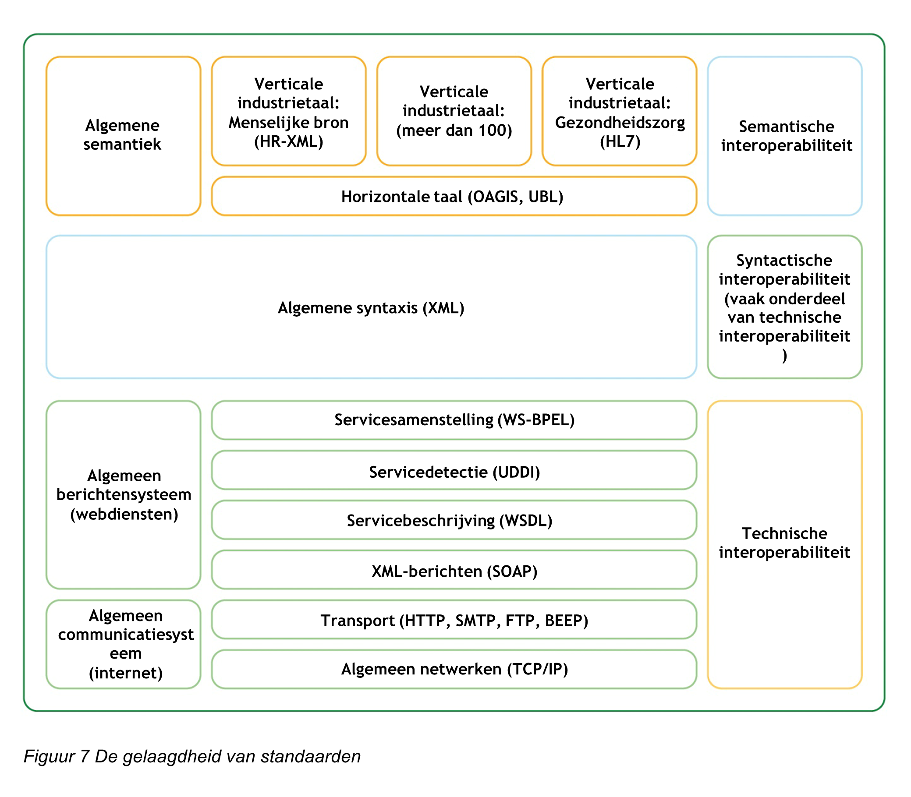
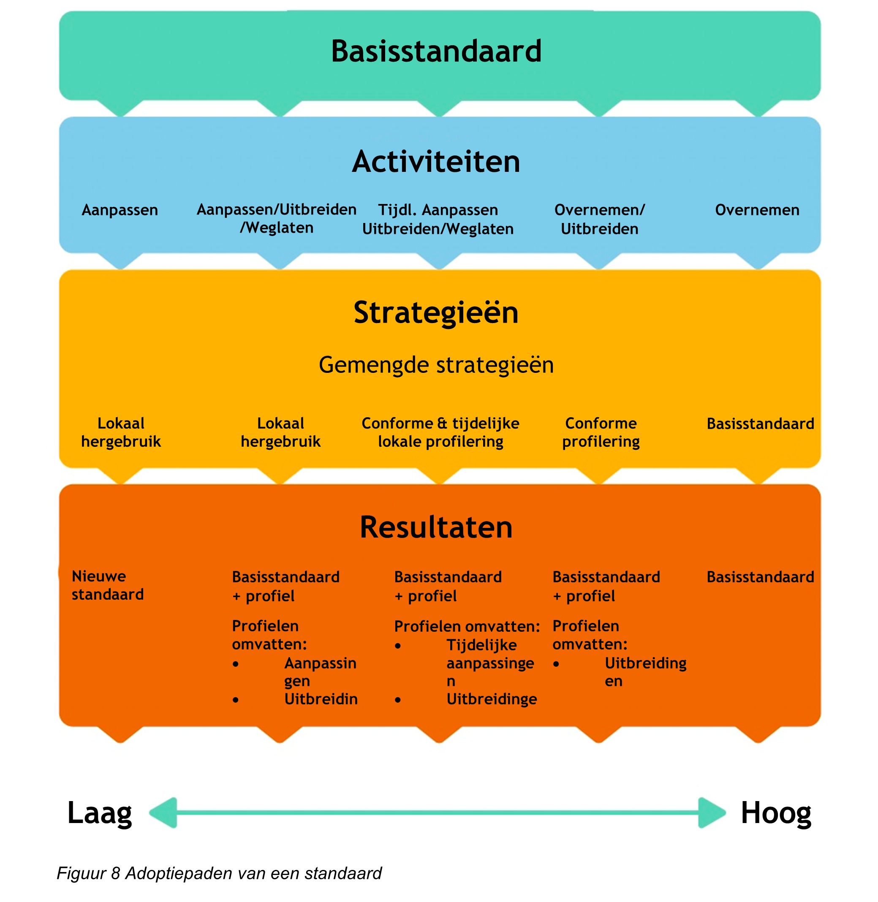
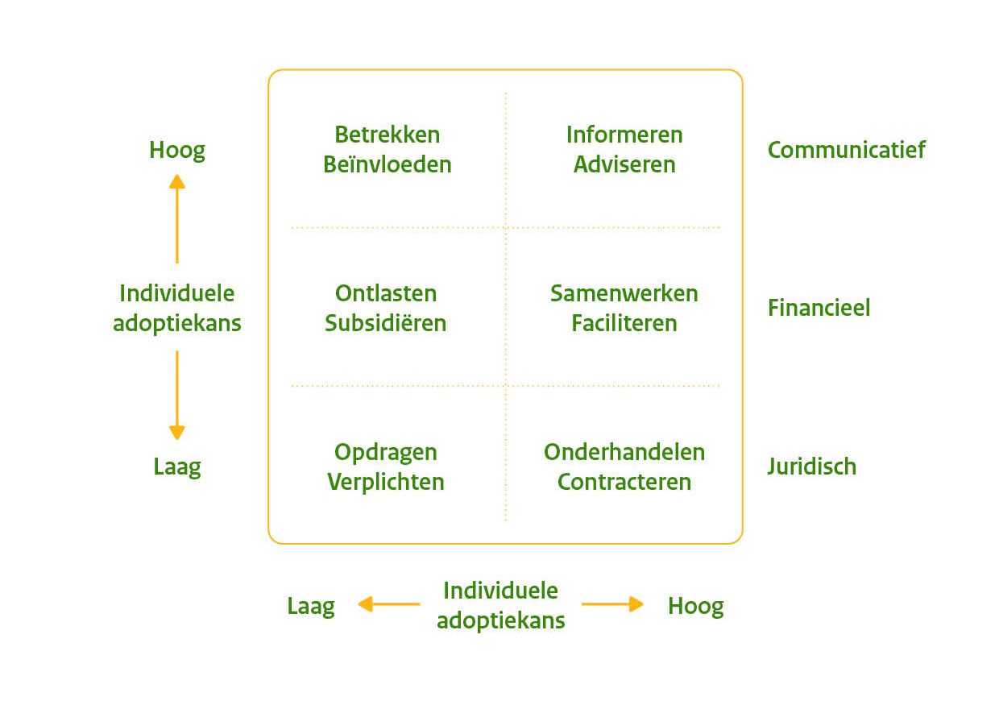
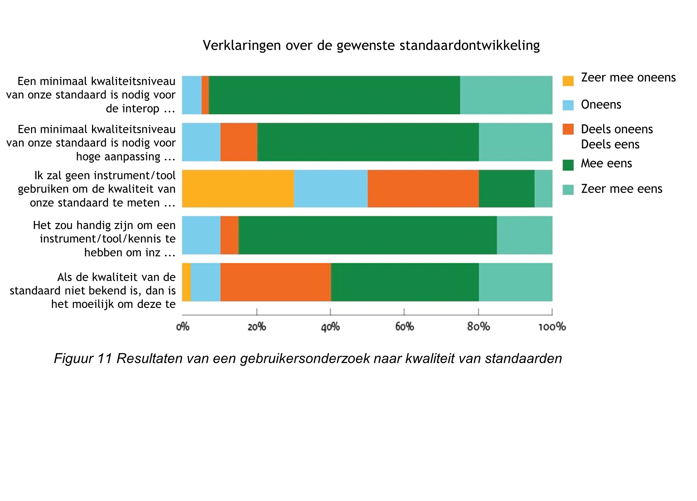
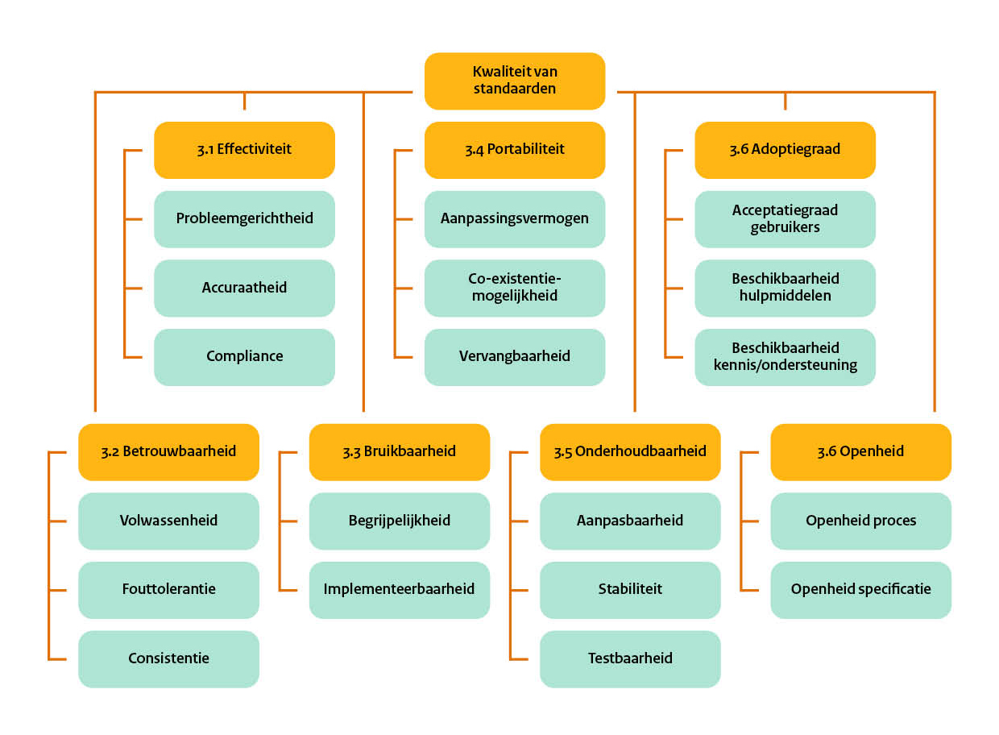

# Tactical
This section looks in more detail at subjects related to tactical subjects from the Management and Development Model.

## The open structure of a standard (Activity Community)

Openness is an important aspect of a sustainable standard. But what does it mean for the management organisation? We can consider this is more detail by considering a definition or model of an open standard. However, over time there has been a great deal of discussion about the definition of openness. The discussion is often focused on the availability (free of charge or nominal amount for purchase), user rights (whether or not to allow Intellectual Property Rights (IPR)/Royalty Free and the standardisation process (free participation yes or no). The model developed by Krechmer provides a neutral and broad vision on openness, which is why we use in the BOMOS.

### Krechmer’s open standards model '10 requirements'

Ken Krechmer developed a model that clearly describes the elements of openness and that allows him to compare standardisation organisations. In the model, he distinguishes between the various aspects of openness (requirements) and the different points of view for standards. For his points of view/roles, he has selected the developer of the standard, the implementer of the standard in a product and the user of the standard (product in which the standard is embedded). Not all aspects of openness are equally relevant for each role, as shown by the model:

|    |Requirements         | Developer | Implementer | User |
| --- | ---         |     ---    |     ---     |   ---   |
|  1 | Open meeting    |       X      |               |           |
|  2 | Consensus       |       X      |               |           |
|  3 | Due process     |       X      |               |           |
|  4 | One world       |       X      |       X       |     X     |
|  5 | Open IPR        |       X      |       X       |     X     |
|  6 | Open change     |       X      |       X       |     X     |
|  7 | Open documents  |              |       X       |     X     |
|  8 | Open interface  |              |       X       |     X     |
|  9 | Open access     |              |       X       |     X     |
| 10 | Ongoing support |              |               |     X     |

For the management organisation, these 10 criteria for open standards have the following meaning:

1. **	Open Meeting** means that everyone is permitted to participate in the standardisation process. No stakeholders are excluded. It is also important that it is possible to participate on a _per-meeting_ basis, at low cost. This means that it is also possible for students or for SME enterprises to join in. Meetings must be clearly announced and there must be as few barriers as possible for stakeholders, to participate. A development and management organisation must be careful with stakeholders wishing to participate. In many cases, it is no easy task to identify sufficient stakeholders who wish to participate actively. In other words, rather than obstacles, it is important to provide incentives. The pitfall is to only open up meetings to a restricted and specified group of (paying) stakeholders.

2. **	Consensus** refers to decision making within the organisation. Is there a (group of) organisation(s) that dominate? In principle, all participants should be given equal rights and contribute equally. The pitfall is to have a dominant group (for example the governing body/parties who make major financial contributions) who have full control.

3. **	Due Process** refers to the processes that describe how voting rounds are organised and the processes for requests to reconsider decisions (appeals processes). There must be procedures for complaints and those procedures must be clear. The same applies to procedures for decision making, in particular the process for resolving potential stalemates. The pitfall is failing to organise these aspects. 
4. **	One World** refers to the ideal situation in which a single standard is used throughout the world for the same objective, also with a view to avoiding trade barriers. Naturally this does not mean that it is not possible to introduce a new standard for a specific purpose or context. It does however mean that no regional or national standard needs to be created if a worldwide standard is sufficient. In general terms, One World also means that the standardisation organisation does not compartmentalise, with a single standard developed without knowledge of other standards/initiatives. The pitfall for the standardisation organisation is to become blinkered, focusing exclusively on its own standard while other good standards are already available, possibly semi-finished. What open means here is open in relation to other standardisation organisations so as to avoid developing overlapping but related issues. Another pitfall is selecting a scope that is too limited for the standard to be developed or managed; for example national rather than worldwide.

5. **	Open IPR** (intellectual property rights) is the aspect that has been the source of most discussion, in which ‘royalty free’ and ‘irrevocable’ have become the buzzwords for the definition of open. For a long time, standardisation organisations and suppliers have attempted to include the term RAND (Reasonable and Non-Discriminatory) in the  definition of openness. It is for this reason that these standardisation organisations do not satisfy the definition of open on this aspect, which means that many standards that are perceived as being open are not in fact open on this point, according to the definition. The definition of an open standard leaves no point unclear, and prevents discussion about the meaning of RAND, for example what is reasonable? This has been the source of much discussion. The standard should be royalty free and irrevocably available. The pitfall is failing to arrive at this situation, which is often the case for semantic standardisation organisations. The intentions are good (open), but by failing to explicitly regulate, it can lead to problems in the future. Furthermore, in many cases, there are no regulations regarding the rights of the contribution made by ‘volunteers’ from external parties to the standard working groups. This is a potential risk for the sustainability of the standard.

6. **	Open Change**: If a supplier is only required to make the standard openly available, but is free at any time to implement changes, the benefits of standards will never be achieved and the supplier retains its position of power. An open method of implementing changes to the standard is of vital importance, but to date has received little attention. Standardisation organisations that fail to comply with the open meeting, consensus and due process requirements are by definition unable to comply with the open change requirement. An open structure can be achieved by describing change processes in which no single party enjoys a special status in decision making. The pitfall is failing to structure the process of change in an open manner, often because there is no attention for this issue.

7. **	Open Documents** means that all documents must be openly available. This does not just mean the standards themselves, but also that _work in progress_ must be made available, together with minutes of meetings, etc. This enables users of the standard to understand the complete background. The pitfall is to only make the standards themselves openly available.

8. **	Open Interface** is above all relevant for technical standards, and relates to leaving space for suppliers for closed extensions, as well as leaving space for backwards and forwards compatibility. The pitfall is failing to address backwards compatibility and not leaving space for temporary extensions (forwards compatibility).

9. **	Open Access:** End users often take at face value the fact that their supplier(s) has/have correctly implemented the  standards. To achieve ‘Open Access’, it must be possible to test the implementation of the standard (for conformity); this can be achieved using conformity testing (test protocols) right through to official certification. Another possibility consists of so-called plugfests in which the interoperability between the different implementations of a standard are revealed. The pitfall here is that postponement will lead to cancellation. To make open access meaningful, the standards must achieve a certain degree of maturity. Which is why implementation is often postponed. And postponement in turn leads to complete cancellation. An open structure also means being open about the use of the standard in implementations, for example by publishing implementation overviews.

10. **	Ongoing Support** refers to the support provided to the standard throughout its lifecycle. The pitfall is to stop providing support as the interest from suppliers wanes. An open structure at the very least means that the lifecycle of the standard is described, according to which users can derive a guarantee about the support for the standard. In the ideal world, support should only end when there is no longer any interest in the standard among end users. 

Many discussions about openness today consider just two aspects of openness, namely ‘One World’ and above all ‘Open IPR’. As a consequence, the other aspects often remain underexposed. When it comes to achieving a maximally open standardisation organisation, every little helps. To date there is not a single organisation that is known to be fully open on every point. Complete openness on all these points is a utopian idea, but each point is worthy of attention and can support the thinking process in achieving greater openness in standardisation. It is also worth realising that in many cases, formal standardisation organisations fail to (or only partially) comply with aspects 6-10.

### Specific tips for openness

Based on the above, we can offer a number of specific tips: Make decision making open by:

* Publishing the minutes of the various forums.
* Consensus decision making
* Not excluding any parties at meetings.
* Producing a website on which all documents (including drafts) are made available free of charge.
* A clear change procedure.
* Making the standards testable based on test procedures, validation, certification and/or plugfests.
* Organising structural financing.
* Focusing full attention on the relationship with other standards in the environment.
* Explicitly laying down the rights; the intellectual property rights to the standards, copyrights to documents, the contribution by individuals in working groups and in the establishment of the standards. Documenting version management: how to deal with backwards and forwards compatibility and how to record support on the basis of the lifecycle of a standard.
* Recording the development and management aspects in a document.

### Making the model assessable

Krechmer’s model is an ideal starting point but in order to offer more practical tips, it can be added to. We have therefore further elaborated the criteria into variables for each criterion. These variables can be better related to the situation in practice. Eventually, scores can then be allocated for each variable; this in turn makes it possible to compare openness between standards. In theory, it should then be possible to define a minimum score for a standard to be described as open. However, this does no justice to the fact that certain variables are more important than others.

The model on the next page is based on the 10 criteria identified by Krechmer, and is a tool for implementing management activities in an open manner. 

|       | Principle | Criteria |       | Variable | Explanation | Score |
| --- |   ---   |   ---   | --- |   ---   |    ---     | --- |
| 1 | Open meeting | Everyone can participate in the standardisation process | 1 | Entrance fee | Is there an entrance fee for standardisation meetings? Is it affordable for the various participants? Free (2 points), Affordable, low or diversified charge (1 point) or costly (0 points) | 0/1/2 |
|   |              |                                                      | 2 |  Accessible meeting locations | Meeting locations must be chosen in such a way that travel costs are minimised for everyone | 0/1/2 |
|   |              |                                                      | 3 | Open to all | Every organisation or person can in principle participate in the development of the standard | 0/1/2 |
|   |              |                                                      | 4 | Open calendar | Is the meeting agenda available online and up to date? Well in advance? | 0/1/2 |
| 2 | Consensus | The basis of a standard consensus | 1 | Open proces | The process of standardisation is public so that everyone can see clearly how issues were decided on | 0/1/2 |
|   |           |                                         | 2 | Procedure in the absence of consensus | There is a procedure for the event that no consensus is reached | 0/1/2 |
|   |           |                                         | 3 | Equal vote | All stakeholders have an equal vote in the decision making. This prevents the presence of dominant stakeholders. | 0/1/2 |
|   |           |                                         | 4 | External review | The results of the standardisation meetings are published which gives external organisations and individuals an opportunity to review the results. This also increases quality. | 0/1/2 |
| 3 | Fair standardisation process | Documented procedures to guarantee consensus during the standardisation process | 1 | Open agenda | It is possible for any stakeholder to submit agenda items | 0/1/2 |
, |   |   |   | 2 | Process management          | Are there regulations that record the procedures and protocols of the standardisation process (method of voting, possibilities for appeal, etc.) | 0/1/2 |
|   |   |   | 3 | Independent chairperson | Are the standardisation meetings chaired by an independent person so that the interests of all stakeholders receive due attention? | 0/1/2 |
|   |   |   | 4 | Possibility for appeal   | If you are dissatisfied with the decision making at a standardisation meeting, is it possible to submit a complaint to a higher body? This body considers this situation and has the authority to intervene | 0/1/2 |
| 4 | Open IPR | Intellectual property rights for the standard are as open as possible | 1 | Rights are published | The way in which legal issues regarding the standard are organised must be public | 0/1/2 |
|   |   |   | 2 | Legal obstacles | The fewer legal obstacles for the use of the standard, the more open the standard is | 0/1/2 |
|   |   |   | 3 | Mutual licences | Adaptations to the standard are automatically subject to the same licences as the original, so amended standards are subject to the same licences as the original, so adapted standards are not impaired by all sorts of legal obstacles | 0/1/2 |
| 5 | One world | The standard can be used for the same purpose worldwide | 1 | Harmonisation | To what extent does the standard tie in with related standards? | 0/1/2 |
|   |   |   | 2 | Location independence | To what extent does the standard contain elements that are unique to a specific geographical location? An open standard should include as few of this type of elements as possible to increase applicability | 0/1/2 |
| 6 | Open documents | Documents relating to the standards are public | 1 | Open concepts  | The concept documents relating to the standard are public | 0/1/2 |
|   |   |   | 2 | Open specifications | The specifications for the standard are public | 0/1/2 |
|   |   |   | 3 | Open minutes       | The minutes of meetings are public | 0/1/2 |
|   |   |   | 4 | Open procedures    | The procedures (such as Consensus and Fair standardisation process) are public | 0/1/2 |
|   |   |   | 5 | Open distribution   | Everyone is free to distribute the documents referred to above | 0/1/2 |
| 7 | Open interface | Compatibility and conformity lead to interoperability | 1 | Compatibility  | Different versions of the standard are compatible with each other (as far as possible). In other words, different versions are interoperable at base level. | 0/1/2 |
|   |   |   | 2 |  Implementation complies with specification | The standard explicitly describes what conformity to the standard means and which criteria must be satisfied. This guarantee is transparent about which implementations conform to the standard. Do two implementations that conform to the standard mean interoperability?  | 0/1/2 |
| 8 | Open access | There are methods for testing and certifying conformity. | 1 | Validation tests | It is possible to test whether a standard is actually correctly implemented. A low-threshold test option. | 0/1/2 |
|   |   |   | 2 | Conformity of validation     | An assessment can be carried out on conformity, which includes validation. The result is recorded in a document.  | 0/1/2 |
|   |   |   | 3 | Conformity of certification  | An assessment carried out on the basis of conformity rules, the result from which is published openly and can result in a certificate.  | 0/1/2 |
|   |   |   | 4 | Disability support         | The standard takes account of people with a disability and satisfies the relevant guidelines.  | 0/1/2 |
| 9 | Ongoing support  | The standard is supported until there are no more users  | 1 | Support throughout the entire lifecycle of the standard. | Support is provided to users of the standard by the standardisation organisation throughout the lifecycle of the standard (from start to finish). In particular also at the end of the cycle, when there may still only be a small number of users and the tendency to offer no further support is great. | 0/1/2 |
| 10 | Open change | Changes to the standard based on openness | 1 | Issuing a new version | Who decides when a new version of a standard will be worked on and when it will be published? This too is subject to consensus | 0/1/2 |
|    |   |   | 2 | Submitting requests for change | Who is permitted to submit requests for change and are they treated fairly (based on a documented procedure)? No parties should be excluded | 0/1/2 |

The Standardisation Forum assesses standards among others for openness for inclusion on the apply or explain list. Krechmer’s criteria are also included in this broader assessment. The model presented here is a more in-depth assessment, intended as a guideline for designing for openness, and not to be used in the formal process for inclusion on the apply or explain list. For more information about the assessment criteria, visit [de website van het Forum Standaardisatie](https://www.forumstandaardisatie.nl/node/229).

### Open structure with Open Source Software

Part of the activity diagram is _module development_. This refers to the ability of the organisation to (commission the) development of software in which the standard is implemented. It is dangerous for a standardisation organisation to do this itself on a ‘commercial’ basis, because this would make the standardisation organisation a competitor for other suppliers on the market. This would rapidly reduce support for the standard by other suppliers. This risk can partly be obviated by using open source for the development. The open source module in which the standard is processed is made freely available which allows commercial suppliers to continue with the process so that in the long term, the standardisation organisation itself can withdraw from the development process, entirely. As such, it is above all a means (incentive) to get the market moving.

Furthermore, Open Source Software is an excellent alternative for closed source software. The primary difference lies in the business model. If a standard is to be adopted, it is important that the standard be implemented in all software, irrespective of the business model. From the point of view of adoption, to give a specific type of supplier preferential treatment represents a certain risk, since it will create resistance among other suppliers.

Open Source Software should never be confused with open standards. They are fundamentally different concepts according to which, from the point of interoperability, only open standards are essential.

## Relationship with other standards (Activity Architecture)

As previously outlined, interoperability is the objective and standards are the means of achieving it. This section discusses the relationship between different standards.

## The stratification of standards

A complex set of standards is needed to achieve interoperability (exchangeability) between organisations or systems. This makes the subject extremely complex, because it is no longer a question of selecting or managing a single standard, but a whole set of standards that are very closely related in certain areas. It is possible to make a distinction between standards for technical matters and standards for the semantics of information exchange. This is demonstrated by the interoperability framework (based on Jian, H., & Zhao, H. (2003). A Conceptual Model for Comparative Analysis of Standardization of Vertical Industry Languages); the examples between brackets are somewhat outdated examples of standards that can be used for this structure.



When it comes to achieving technical interoperability, choices will have to be made. In many cases, a technical philosophy is chosen, which relates to a family of standards; In truth, there are not many possible choices. For example the internet is the most obvious communication mechanism based on the standards TCP/IP, HTTP, etc. When it comes to the messaging (transport) mechanism, there may be more choice, but for some time the obvious choice has been the Web Services family, whereby REST APIs have recently de facto become the standard. The choice of Web services brings with it a choice in favour of individual standards (such as SOAP, WSDL, etc.). It should however be remembered that it is not enough to simply opt for these technical standards. To achieve real interoperability, other profiles are generally also needed over and above these standards, which describe how the options should be structured within the standards. Although not domain specific as such, the structure is often created for each domain, above all as a means of offering users a complete interoperability solution in combination with the semantic standards.

<aside class="example" title="Gelaagdheid bij standaardisatie van e-facturatie">
The stratification of standards is excellently demonstrated in the Standardisation Platform E-invoicing (STPE). In this case, the standard in question is the EN 16931: a European standard that describes a semantic model for the core invoice (Common Semantics). This model is expressed in two Horizontal Languages: UBL and UN/CEFACT Cross Industry Invoice (CII). Both of these languages are built on XML as Common Syntax. The EN 16931 standard issues no statements about how the Technical Interoperability should be structured. 

In semantic terms, the stratification does not end with the European core invoice. In the Netherlands, a national profile of the EN 16931 standard has been specified, to promote use of the standard in the Netherlands: the  NL-CIUS (Core Invoice Usage Specification). There are even sectoral associations which in turn further specify the NLCIUS. The SETU Invoice for example is a further layer on top of the NLCIUS with a number of restrictions and instructions aimed at promoting the use of the invoice standard in the temporary employment domain.
</aside>

Finally, the technical standard JSON is today the most obvious choice. In the past, the most appropriate technology was XML, and before that EDI. Although these are still widely used in existing situations, they are no longer used in new situations.

Even if the technical standards set the parameters, the real challenge lies with the semantic standards which focus on the meaning of the information exchange. Vertical semantic standards are focused at a specific sector while horizontal standards go beyond sectoral boundaries. In practice, vertical standards are essential to successfully tie in with the context of the organisation. Vertical standards can represent the further implementation of horizontal standards as explained in the next section.

To make this situation even more complex, there are standards that are used to make standards, for example the UML standard which is used as a language for drawing diagrams that contain the process and data model for a standard.

## The lifecycle of stratified standards

The use of a stratified family of standards makes it necessary to actively work towards applying _up-to-date_ standards. This can represent a challenge. When an underlying standard transitions to a new version, it may be necessary to adapt the overlying standard to the underlying standard.

It is therefore important that the underlying standard be managed by _active management_ . Only if the standard in use is managed is it possible to accept requests for change and correct possible mistakes in the standard. If a stratified standard makes use of an underlying standard which is _not_ managed any longer, the possibilities for updating the standard are limited. 
In other words, it is advisable when managing a stratified standard to actively monitor developments in the underlying standard(s) if you wish to be able to switch to a new version.

### The relationship with international standards

Compared with other standards, semantic standards are incredibly complex and are developed and managed in a different way. The majority of IT standards are already developed outside the official standardisation organisations (such as ISO and NEN), in so-called industrial consortia such as W3C and OASIS. However, when we look at semantic standards, we must go a step further, because for the most part these are developed internally within the own organisation.

<aside class="example" title="Semantische internationale harmonisatie van Aquo">
 The management of the North Sea requires international exchangeable data about seawater. The Aquo standard was only suitable for the Dutch Continental Shelf. And that represents just part of the North Sea. However, in order to tackle (policy) issues relating to the entire North Sea, Dutch managers must be able to exchange data for example with English data managers. That in turn requires an international standard. In the first phase, the Informatiehuis Water is working to compile a dictionary, together with a consortium of relevant parties. The dictionary is a table with on the one hand the Dutch Aquo term and on the other the English SeaDataNet/EMODnet term.
</aside>

Practice shows that distinguishing only between horizontal and  vertical standards is too restrictive. International vertical standards often also require a specific structure, for example in the context of a country (such as the Netherlands) in order for them to tie in perfectly with the business processes in that context. This is vital to achieve interoperability. As a result, standards, also referred to as agreements or application profiles, are created at national level, that contain a further implementation of an international standard. In addition, specific code lists for the national context are often added. This results in the following classification:

*   International horizontal standard
*   International vertical standard
*   National standard/application profile/agreement/taxonomy
*   National vocabularies, code lists, etc.

This is also reflected in the organisations: HL7 is the international standard, but there is also an HL7 Netherlands. For international HR Open Standards, it is SETU that produces the Dutch HR Open Standards profiles.

Whatever their form, be they an international horizontal standard or a national code list, they all have to be developed and managed! This does not however mean that all four classifications must be present in a specific application domain. In practice, depending on the situation, any combination may occur.

<aside class="example" title="OGC Observations & measurements als basis voor IM Metingen">
IM Metingen is a standard prepared jointly by soil managers and water authorities to facilitate data exchange across the different specialist fields. However, even at the design stage, the possibility of international data exchange was taken into account. 
IM Metingen is based on the international standard OpenGIS® Observations and Measurements (O&M). Observations and Measurements is a standard for describing observations and measurements. These observations and measurements are in turn linked to a location. Using O&M, it is possible to model and to exchange observations and measurements, in an international model.
</aside>

During the adoption phase, one commonly heard comment is that people only wish to adopt the international standard, as opposed to a national version. Based on the argument that they do business worldwide, or that the international standard ties in more broadly or is more  widely known. However, in practice this will result in restricted interoperability, because the international standard will tie in less successfully, and in many cases will feature too many degrees of freedom. Given that interoperability is the objective of standards, this is not a wise choice. Instead, it would be wiser to focus on the national standard that ensures tying in with international standards and guarantees optimum application in the Dutch context.

It is also useful in the management phase of a standard to continue to focus attention on international standards. If no appropriate international standard is available during the adoption phase, a national standard may be the only option. But that situation can change. One example is the Digikoppeling (Digilink) standard. Digikoppeling comprises an interface specification which serves the same purpose and application as the European eDelivery, which was adopted later. In the framework of standards management, the decision could be taken to phase out the national standard in favour of a more recent international standard. Here, too, a national profile on the international standard could be valuable. It does however mean a different role for the management organisation. If necessary, the management organisation will represent Dutch stakeholders in managing the international standard.

One vital point for attention in relation to international standards is that in the case of an international  vertical standard combined with a national application profile, for example, a different name must be applied to each, in order to avoid confusion in practice.

### Examples of stratification of standards

Finally, even within the standards themselves, stratification can occur in different ways. For example between vertical and sector models and horizontal standards, in addition to which other (e.g. technical) standards are often combined to offer a total solution for interoperability.

<aside class="example" title="XBRL">
XBRL is an example of an international vertical standard (in the financial sector) for which national taxonomies have been drawn up, for example the US GAAP or in the Netherlands by the SBR programme.

In the framework of e-invoicing, the Dutch government opted for an international horizontal standard (UBL) after which an invoicing model was developed internally, to restrict the degrees of freedom. Here, too, we see a national application profile with the eventual aim of achieving interoperability.
</aside>

<aside class="example" title="Metamodel voor Informatiemodellering">
To ensure a better match between all information models in the Netherlands, a metamodel was developed for information modelling. This model brings together all the modelling knowledge of Geonovum, the Land Registry and VNG Realisie. This standard helps promote interoperability between other standards. 
</aside>

### Cross-sectoral interoperability: Compartmentalisation

The sector-specific approach to semantic standards raises the fear of compartmentalisation between sectors. The question of cross-sectoral interoperability is not solved and may even be exacerbated. The potential problem is widely recognised and solutions have been conceived, but to date they all collapse with very low adoption and lack of grassroots support. There are two possible causes:

1. The problem of cross-sector interoperability is not yet seen as urgent given the greater challenges present within the sector.
2. The proposed technical solutions are often extremely complex. One technically attractive solution for example is the UN-CEFACT Core Components standard. Although more than ten years old, this standard has never enjoyed broad adoption.
The core of the solution is probably not a technical one, but lies with the management organisations active in the various domains. They all have to adopt a less fragmented approach and work better together with their fellow management organisations from related sectors. There have been improvements in this respect in the past few years. In part this is due to ‘open’ thinking because in a _one world_ ([zie sectie over openheid](#de-open-invulling-van-een-standaard-activiteit-community)) there are no competitive standards and the standards match perfectly together.

### The relationship with formal standards

The previous sections are clear indications that in most cases semantic standards are stratified and as such build on or make use of other standards. One interesting problem that is generic to the development of standards, but that becomes abundantly clear in the pressure cooker, is interaction with formal (e.g. ISO, CEN, NEN) standards. The basic underlying principle is that as far as possible, existing standards should be reused, rather than constantly reinventing the wheel.

There are a number of sore points when it comes to formal standards:

**The inability to access the formal standards:** In the pressure cooker session, it was suggested on a number of occasions that an existing formal standard could already contain a (partial) solution. However, no one knows for sure, because no one has been able to access the standard because of the related costs. Even if those costs can be limited, the threshold remains high. At the end of the day, the supervisor still had to purchase the standard, only to discover, sometimes after just three minutes, that the standard was unusable. This situation is a clear obstacle to rapid progress (in the pressure cooker). In practice, it is clear that even a ‘free registration’ (for example at Geonovum and SETU) is perceived as a too high threshold.

**The costs during the development of standards:** Broadly speaking, the costs for buying a formal standard (specification document) are around 100 euro per standard. A relatively small amount when it comes to developing a new standard. Nothing more than a shame if it becomes clear immediately following the purchase that the standard is not relevant. The greater problem lies in numbers; it is almost never the case that only a single standard has to be purchased. In the case of the pressure cooker for the waste sector, in addition to purchasing a DIN standard, NEN and ISO standards also had to be purchased, and the ISO standard was made up of four parts, each of which had to be purchased individually. The outcome was higher costs and higher levels of frustration about the hassle involved. That hassle often also relates to the purchasing process within an organisation. Very quickly a sense of _let’s not bother, it’s probably useless anyway_ will emerge.

Since NEN working groups have unlimited access to the standards, this problem can be obviated by establishing the working group/pressure cooker under the auspices of the NEN. However, establishing an NEN-based working group also costs money.

**Reuse:** Formal standards are extremely valuable. Also in the pressure cooker for the waste sector, existing formal standards contain sufficient valuable information to avoid the need to completely reinvent the wheel. The issue that then rises is the lack of clarity about how the formal standards permit reuse. There are two options: 
* Reference to the formal standard, but this results in costs for implementations (see below).
* Adopt a section from the formal standard.

The second option is particularly useful if the formal standard has a far broader application (or applies to a different domain) but with choices that are also perfectly applicable to ‘our’ standard. It does however raise questions about the openness of the end result. The rule of thumb at the NEN is that 10% may be copied, following consultation with the NEN. Permission must be sought from the NEN to allow them to check that no patents based on the formal standards are infringed.

**The costs for the implementation:** If reference is made to an existing formal standard, every supplier wishing to implement this standard will be required to purchase the formal standard in question. Even if their own standard is open and freely available, by referring to an existing standard, we unavoidably create an obstacle to adoption with the potential risk that the standard will be incorrectly implemented because the decision is taken during implementation to not purchase the formal standard. In other words, all implementing parties are saddled with costs thereby creating an obstacle to adoption and interoperability, which was never intended.

### Strategies for dealing with localisation profiles

If we wish to use an international standard in a national, sector-specific context, we automatically create an important dependency. Depending on the context and the strategy chosen, the relationship between the national and the international standard can be implemented in different ways. Ideally, the international standard is fully adopted, but as we know from practical experience, an international standard can almost never be simply copied, one on one; in some cases the changes are limited; just a small number of extra issues have to be added for the specific national context in order to achieve interoperability.

The following situations can arise:

* The specific context requires extensions/adaptations to the standard.
* The standard includes numerous extraction issues which result in additional complexity not necessary for the specific context.
* Mistakes are found in the international standard.
* Items are missing from the standard that are not specific to the context.
* There is a need for a new standard.

Generally speaking, in these situations, the following activities can be undertaken:

* Make adaptations to the international standard (without returning the adaptations to the international standard) (Adaptations)
* Implement permitted extensions to the standard (Extensions)
* Remove items from the standard (Omissions)
* Temporarily adapt the standard (we make the necessary adaptations to the international standard, but only need a solution that is temporary, until the international standard is adapted) Temporary Adaptations)  



The strategies:

|  Strategy | Characteristics |
|     ---   |     ---  |
| Local Re-Use  | We reuse the international standard but adapt it to the needs and create a new standard |
| Local Profiling | A profile (that does not comply with the international standard) on top of the international standard, in which all adaptations are included. |
| Compliant & Temporary Local Profiling | A profile in which in principle only permitted extensions are included, but which also contains temporary solutions to issues submitted internationally, but which justify a temporary solution. These temporary solutions do not comply with the international standard. |
| Compliant Profiling | Only extensions in a profile that complies with the international standards. |
| Comply | 100% adoption of the international standard without extensions or adaptations. |

In particular if the intention is to achieve international interoperability, the best solution is as far as possible to remain in line with the international standards and to select a strategy on the right-hand side of the figure, if possible compliant profiling. However, this requires harmonisation with the international standard, which involves costs for example due to attending the international standardisation meetings. If your aim is to achieve interoperability in an international context this is essential.

### The Linked Data standards for semantic modelling

Linked Data has already come a long way, to the situation in which it has become the de facto standard for semantic modelling. The standards and technologies covered by Linked Data -- such as RDF, SPARQL en OWL -- are becoming increasingly widely used in practice. It started in the academic world but over the past few years has spread into both the public and the private sector.

Linked Data results in changes to the sematic standardisation discipline described by BOMOS. It is not merely a question of using new technologies and tools. Linked Data means a different approach to semantic interoperability: the emphasis is shifted from standardisation of messages (or ‘transactions’) to the standardisation of the underlying domain description; the language. The language in a domain is standardised using vocabularies and ontologies but it also becomes possible to create links between domain ontologies in such a way that Linked Data can break down the barriers between sectors, until it becomes a tool for cross-domain interoperability. In addition, Linked Data standards satisfy the open standards criteria, and a number have already been included in the apply or explain list published by the Dutch government.

<aside class="example" title="Floricode en de uitzendbranche">
Over time we have seen shifts in attention within Floricode, based on architecture choices. The attention for traditional message (exchange) standardisation, for example, has shifted towards master data for horticulture. 

We see a similar development in the temporary employment sector. Traditionally, SETU has offered standardised message specifications for widely used and generic integration issues, such as Placement, the Time sheet and the Invoice. To make it possible to continue to solve digital integration challenges in a more modern, flexible and cost-efficient manner, SETU is increasingly shifting towards offering a common language (ontology). This SETU language consists of concepts and relationships with the related terminology and definitions. These concepts and relationships are used as building blocks for creating message and API specifications in different formats. 
</aside>

### Promoting the use of standards (Activity Adoption & Recognition)

Many standardisation organisations are looking for opportunities to encourage the use of their standard. This can be achieved in several different ways. The related strategy is referred to as an adoption strategy.

### Success factors for the adoption of a standard

Working groups at the Standardisation Forum have identified a number of critical success factors that played a role in the adoption of various standards:

1. The standard must be mature; otherwise no one will be willing to invest.
2. Patience: Adoption of a standard takes time, sometimes several years.
3. The benefits must be clear to everyone, in the business process, in society and financially; there is support.
4. There must be a dedicated problem owner, specifically because adoption takes years; true commitment is essential.
5. There must be a critical mass of users.
6. A leading party or a leading process can massively encourage adoption.
7. There must be an active community involved in the development and use of the standard.
8. There must be funding for support, training, remuneration, etc.
9. Use a good mix of adoption tools.

### Choosing the right tools

Selecting the ideal strategy for promoting the adoption of a standard is no easy task. Sometimes there is no need for such a strategy, because the standard is fully ‘supported’ by parties in the field. However, in many cases, a standard is part of a broader development. For example a standard for the digitalisation of a chain. The introduction of the standard relates to the question of whether an organisation intends to start the process of digitalisation.

The tools for adoption can be divided into three groups:

* Financial: the ‘carrot’ that encourages adoption by facilitating use of the standard. Examples of the tools available include offering a grant or supplying implementation instruments that reduce the costs of implementation.
* Communication: the ‘sermon’ supplying information about the benefits offered by the standard to the organisations. For example by writing articles or organising seminars.
* Legal: the ‘stick’ making use of the standard compulsory. For example by including the standard on the list of open standards for ‘apply or explain’ as produced by the Standardisation Forum.

In most cases there is no single ideal strategy. The choice will depend on the existing and desired situation and numerous environmental factors. Adoption tools can for example differ in terms of or depend on:

* the choice of the primary target groups to be appealed to: all users, specific users, software suppliers.
* the tools employed: seduction, contracts, legislation, commercial compulsion
* the approach: start small or start big right from the start; first a small group, or the whole target group right from the beginning; first a small part of the standard, followed by more, later.
* the existing situation in the target group: Is data exchange already common practice? Are older or other standards already in use?
* the dominant benefits offered by the standard or the dominant problem for which standards offer a solution: Where can the greatest benefits be achieved with the standard? And where are the costs? Who is worst affected by the current restrictions?
* intrinsic aspects of the standard: How complex is it? What is its scope? What knowledge is needed in order to implement the standard?

Examples of adoption tools:

* Informing/advising.
    * Organising information events.
    * Information days.
    * Presentation at a conference.
    * Articles in magazines.
    * Advice on use of the standard.
* Involving and influencing.
    * Drafting and sharing collective business cases.
    * Documenting cases.
    * Publishing an overview with users.
    * Open standardisation process.
    * Establishing a sounding board group.
    * Community building.
    * Establishing a collaboration platform.
    * Harmonisation between software suppliers of users.
* Cooperation and facilitation.
    * Testbed for standard implementation.
    * Implementing shared pilots.
    * Organising a plugfest.
    * Establishing partnerships.
    * Validators.
    * Business case tool.
    * Reference implementations.
* Unburdening and grants and subsidies.
    * Grant for introduction.
    * Financing implementation at software suppliers.
    * Drawing up a specific action plan.
    * Introducing own implementation to serve as ‘broker’.
    * Certification
    * Free implementation support.
* Negotiation and contracting.
    * Administrative embedding at users.
    * Drawing up a covenant.
    * Drawing up a contract between the governing actor and chain parties.
* Imposing and obligation.
    * Imposing the standard via the list of open standards for ‘apply or explain’.
    * Legal compulsion.

### Step-by-step plan
Below we describe five steps for making the right choices to encourage adoption by specific sector organisations:

#### Step 1: Suitability
There must be a clear match between the standard and the questions within the sector in question:

* How large is the interoperability problem?
* How complex is the nature of their interactions?
* Does the standard represent a good match?

Adoption can only be successful if the match is sufficient.

#### Step 2: Individual business case
The next step is to investigate the precise nature of the target group:

* Which parties are involved?
* What does the business case look like for them?
* How much space for change is there in the business case?
* Is there a party who could enjoy ‘first mover’ benefit?

This provides a clear picture of the business case for each (type of) organisation in the network. The stronger the individual business case the higher the likelihood of individual adoption.

#### Step 3: Collective analysis
As well as developing individual business cases, we must also consider a collective business case. What benefits does the standard offer for the whole network of organisations?

The stronger the collective business case the greater the likelihood of collective adoption.

#### Step 4: Tool selection and planning
The next step is to identify the most appropriate tools for the likelihood of individual and collective adoption.

Where there is a high likelihood of individual adoption, the best choice is generally a communication tool. After all, whatever the case, it is likely that the organisation will decide to adopt the standard.

As a rule, an average likelihood of individual adoption will result in a financial tool. The organisation needs a gentle nudge to encourage adoption of the standard. Where the likelihood of individual adoption is low, the most successful choice is a legal tool. Unless required to do so, the organisation is unlikely to take the decision to adopt the standard.



### Plugfest

A plugfest, plugtest (or ‘connectathon’) is an adoption tool that falls under the heading cooperation and & facilitation. The central idea behind a plugfest is to bring together the suppliers who have implemented the standard, and to use scenarios to test interoperability between the suppliers/systems, on the ground.

During a plugfest, the implementation of a standard is assessed at a meeting, by investigating whether the information exchange the standard aims to bring about is actually achieved. Scenarios can be used for this assessment procedure. In these scenarios, the steps are implemented which also have to be followed during the normal everyday use of the standard. The scenarios are focused on the exchange of information between applications.

If a scenario proves unsuccessful, the underlying cause must be investigated. The causes need not always relate to the implementation of the standard. Interoperability can be hindered by other causes. If possible, the problem is corrected on the spot, and scenarios run through, once again. 

From the point of a standardisation organisation, organising a plugfest can make a positive contribution to:


**interoperability:** plugfests offer suppliers that have implemented the standard an opportunity to assess the implementation of that standard against other implementations by other suppliers. Any errors that emerge can be corrected immediately or at a later stage, and components of the standard that are shown to be insufficiently clearly specified are revealed during the procedure.

**transparency:** at the end of a plugfest, suppliers know the identity of colleagues with whom they can cooperate, on the basis of the standard. Any audience at the plugfest will be given a picture of how the various suppliers use the standard, and which applications from the suppliers work well together.

**adoption:** by participating in a plugfest, suppliers can boost their presence. By inviting an audience, the standard can also be brought to the attention of end users.

#### An example: plugfests in educational practice

In the field of education, a plugfest was organised focused on the standards for digital teaching materials. The plugfest was attended by both suppliers and end users. There was close contact with the participating suppliers prior to the plugfest, and they were asked to supply teaching materials in advance. These materials were then assessed by Kennisnet and based on the results, the suppliers were given a second opportunity to submit an improved package of teaching materials. The scores from the second assessment were announced during the event. During the plugfest, suppliers were given the opportunity to show how well they were able to use teaching materials stored in the standard, in their software. There was also an opportunity for users to assess whether their own material worked in the various applications from different suppliers. Almost all suppliers who took part during the first round also participated in round two. The second event in fact even attracted new suppliers. The winners of the plugfest included the result of the event in their company’s promotional materials.

#### Learning points, focus points, dos and don’ts

**Choose**: A plugfest focused on interoperability is a completely different event from a plugfest focused on adoption/transparency. A plugfest for interoperability, for example, can be a closed event focused on support for suppliers and appropriate to the early life phase of a standard. A plugfest for adoption is very open in nature, with publicity, aimed at transparency and appropriate to the mature life phase of a standard. It is necessary to make a choice.

**Decide clearly what will be assessed and how.** You may not be dealing with the complete standard but only individual parts. Communicate clearly about the assessment criteria and the assessment process.  
**Involve suppliers at an early stage;** they are the heart of the plugfest.  
**Create benefits for suppliers.** For example by combining the plugfest with the opportunity to demonstrate their products to end users. Ensure media attention for the standard and for the suppliers.  
**All participants are winners!** This point must also be clearly communicated. After all, the participants are willing to adopt a vulnerable position and contribute to overall transparency. The same cannot be said for non-participants.  
**Give suppliers and opportunity to prepare thoroughly.** Possibly cooperate with implementation assessments prior to the plugfest, for example via other validation techniques.  
**Ensure sufficient expertise during the plugfest.** These can assist in implementing the standard. They may be employees of the standardisation organisation, but could equally be external experts.  
**We advise against working with a panel,** since this delivers subjective scores and takes a great deal of preparation time.  

#### Factors for adoption

Another way of looking at the adoption of a standard is by analysing the factors that contribute to the adoption process. For each of these factors, there are tools which could improve adoption rates:

**Relative benefits** contribute to the adoption of a standard. An organisation benefits from using a standard. Those benefits can be made more visible by:

* Communicating the benefits.
* Demonstrating business cases.
* Developing best practices.

High **adoption costs** have a negative impact. You must try to lower these costs. For example by: 
* Awarding grants and subsidies.
* Making implementations easier, for example by supplying tools. 
**Institutional effects** relate to agreements reached by law or in a sector, which have a more or less compulsory character when it comes to using the standard. Instruments include:

* Reaching contractual agreements with users.
* Inclusion in statutory agreements or via the ‘apply or explain’ list.
* Other legal obligations.

One important but often forgotten factor is community ideology. Having a strong community surrounding a standard can contribute to its adoption. By reinforcing the  community and if possible identifying ‘evangelists’, the rate of adoption can be enhanced.

Due to network effects, wider use will have a self-reinforcing effect. It can be used as part of the adoption strategy. For example by attracting a large organisation to use the standard, by organising partnerships, by offering free implementations or by organising a plugfest.

### Adoption within user organisations

As a rule, standardisation organisations have above all a network perspective on the adoption of their open standards. Another perspective is that of the individual organisation. The individual organisation is required to make choices with regard to the standards to be used. The governance tools for specifically focusing an organisation on the adoption of open standards include:

**Compliance management:** in which an organisation defines how it deals with mandatory standards.  
**The IT policy:** in which an organisation defines its policy outlines in the field of IT and open standards. Architecture management: the models and principles (including the standards to be applied) which make up the IT landscape.  
**Portfolio management:** the quality criteria for projects, the deployment of tools for IT innovation, and renewal projects. This for example is relevant to the allocation of resources to a migration towards a specific (new) open standard.  
**Purchasing and supplier management:** the requirements imposed on suppliers.

For a standardisation organisation, these are the approach points for encouraging adoption within a specific party. They also represent the link to the adoption tool the standardisation organisation can deploy. For example:

1. By using legal means (apply or explain, inclusion in the law) an organisation is compelled to determine within the compliance management process how a specific standard will be integrated.
2. By giving examples or offering reference models, it is possible to encourage an organisation to include a standard in its target architecture.
3. Financial resources can boost priority for migration to a standard in the portfolio management process.
4. Finally, for example by providing model specifications, adoption can be accelerated in relation to purchasing.

** Quality policy and benchmarking

### Quality of standards

Many organisations strive for interoperability in which semantic standards are a means of achieving this objective. Numerous semantic standards have indeed been introduced over the past few years. Nevertheless, little is known about the quality of semantic standards. This is remarkable, given that the quality of those standards will undoubtedly impact on the extent to which the interoperability objective can be achieved.

Unlike other disciplines such as software engineering, little literature or knowledge are available about what makes a good quality standard, capable of delivering an effective contribution to interoperability. This then is the perfect definition for our term quality: fitness for use! (the definition provided by quality guru Juran). Government policy is above all aimed at the openness of a standard, which is just one aspect of quality. A high quality standard is undoubtedly an open standard, but the opposite is not necessarily the case: an open standard need not by definition be a high-quality standard. In the assessment of standards for the ‘apply or explain’ list from the Dutch government, although a strong emphasis is placed on openness, there is also a recognition that other quality aspects (usability, potential and impact) must also be taken into account in assessing for inclusion on the list.

Generally speaking semantic standards are developed in-house by an organisation and not within large standardisation organisations. This can impact on their quality; at the very least, it means that for each semantic standard, the quality can vary widely. 

<aside class="example" title="Floricode">
[Floricode](https://www.floricode.com/) used this quality instrument to raise one of their standards to a higher level of quality, in practice. It resulted in an extensive analysis, including four pages of suggestions for improvements. 
Some of these suggestions are more strategic in nature (e.g. transforming Floricode (for this standard) from a counter for technical solutions into an agency for information solutions, driven by parties in the horticulture chain). Others were very practical and concrete improvements, for example for a test environment (make checks in the test environment very specific, clearly indicate which tests have been undertaken and how the result of the test centre must be interpreted). All in all a valuable exercise.
</aside>

#### What do standardisation organisations themselves think of quality?

A study among 37 management organisations for standards (including international standards such as XBRL, HR-XML, ACORD and HL7 and national standards such as SETU, StUF and Aquo) reveals that more than 90 percent of the consulted developers of standards believe that the quality of their standard can be improved (see the figures below). A very large majority also believes that improving the quality of their standards would contribute to better interoperability.




#### So what needs to be done?

The study also shows that the quality of a standard is essential to achieving the eventual goal of interoperability (more than 90 percent of respondents share this opinion). Less convincing but still highly present is the relationship between the level of quality and the likelihood of successful adoption of a standard. In other words, there is space for quality improvement that could result in improved interoperability and improved adoption of the standards. However, it is difficult to improve quality if the level of quality is unknown. The respondents (more than 80 percent) wish to use an instrument for determining the quality of their standards. But such an instrument must be available.

The results of the study also show that standardisation developers are very much inclined to strive for high quality but are open to a critical assessment of their work through the application of a quality instrument. The possible lack of quality in a standard may have multiple causes, but the motivation of the standardisation developers can be excluded as one of those possible causes. Previous studies have already shown that specifically in the case of semantic standards, the developers are intrinsically motivated; in other words, they see their work as their hobby, too.

It is extremely probable that there is a relationship between the budget and the quality of standards. Standards are often developed with the minimum possible budget, which undoubtedly has consequences for the quality of the resultant standards, for example because the standard is handed over as soon as the budget runs out, while just one more round of review and processing would have resulted in a better standard.

Another possible reason is the lack of standardisation expertise, since standardisation is still insufficiently recognised as a ‘specialist skill’. The desire to please everyone within the standardisation working groups also does not make a positive contribution. All too often, too many options are included in standards with a view to satisfying the wishes of all the participants in the working groups. The result is an overly complex standard which is poorly implementable in practice, and which results in non-interoperable implementations, all of which still do satisfy the standard.

#### The quality instrument

So what would an instrument for measuring the quality of a standard actually look like? A quality instrument for standards is a complex subject; it first requires us to know: what is a good quality standard? Which quality aspects have an impact, and how can they be measured? But also with regard to the subject itself: what is a semantic standard? What components make up a semantic standard? It is these aspects that the quality thermometer will have to examine. It is not only important to know what the quality thermometer should look like, but also where it should be inserted.

The quality model we offer with BOMOS is based on the PhD research work of Erwin Folmer. It is aimed specifically at semantic standards, but is based heavily on quality research and standards in relation to software development; an area in which much quality research has been carried out. The quality model has been validated by experts and used in different situations.

The quality model as presented here is not the complete quality model. The complete quality model goes one level deeper with quality concepts, as well as providing suggestions for conducting the measurements, right through to a process model for the use of the quality model, so it can be deployed as an instrument. The complete quality model (and instrument) are part of the thesis [[[folmer2012]]].

<figure id="kwaliteitmodel">

```mermaid
graph TD;
    quality(Quality model for semantic standard);
    product(A. Product quality);
    process(B. Process quality);
    practice(C. Quality in practice);
    standard((Maatregel in<br>inhoud,<br><i>de standaard</i>));
    organisation((Maatregel in<br>ontwikkeling en<br>onderhoud,<br><i>de organisatie</i>));
    implementation((Maatregel in<br>toepassing,<br><i>de implementatie</i>));
    quality-->product;
    quality-->process;
    quality-->practice;
    product-->standard;
    process-->organisation;
    practice->implementation;
```
  <figcaption>Het kwaliteitmodel</figcaption>
</figure>

The quality model makes an important distinction between product quality, process quality and quality in use (in practice). Product quality relates to the products/deliverables of the standardisation process, and as such can be measured in the content of those products, in particular the standard specification document, but also in its technical derivatives. This then is the intrinsic quality of the standard. First and foremost, process quality relates to the process of creating the standard, followed by the management process. Process quality is measured in the management organisation of the standard (often referred to as the SDO (Standard Development Organization) or SSO (Standard Setting Organization). Finally, it is important to know whether the standard offers an implementable and workable solution in practice; this is part of the quality in use.

This three-part structure makes the use of the model flexible. It not not necessary to implement the entire model, but based on the question posed, the relevant part of the model can be selected. The following typical questions can be answered with the various parts of the quality model as identified, respectively:

1. What is the intrinsic quality of the standard? – Part A.
2. What is the implementability of the standard? – Parts A and B.
3. What is the sustainability (future-proofness) of the standard? – Parts B and A (in part).
4. Should I select the standard? – Part C (mainly).
5. Does the standard offer a good solution to the problem of interoperability? – All parts.

**A. Product quality**

If we consider product quality more specifically, we are able to answer the following questions in more detail:
    
1. Is the functionality covered by the standard applicable? – Does it have the capacity to solve the interoperability problem?
2. Is the standard stable? – Can it be implemented and used without obstacles?
3. Is the standard sustainable? – Is it ready for the future?

The table below covers the first two (of the three) decomposition layers for product quality, including definitions and explanatory notes. It provides us with numerous valuable starting points for more closely examining the quality of a standard.

| **Measurable Concept**   | **Definition**  | **Remarks**  |
|--------------------------|-----------------|--------------|
| **A. Product Quality**     | The total attributes of a standard that determine its ability to satisfy stated and implied needs when used under specified conditions. | This includes both internal and external quality in ISO terms. |
| **A1. Functionality**      | The capability of the standard to provide functions which meet stated and implied needs when the standard is used under specified conditions. | The specification fulfills the functional needs of the intended job. |
| **A1.1 Completeness**      | The extent to which a standard is of sufficient breadth, depth, and scope for the task at hand. | This includes other terms like relevancy and suitability, and is the functional view on the content of the specification. The task at hand is aimed at solving an interoperability problem.                     |
| **A1.2 Accuracy** | The capability of the standard to provide true data with the needed degree of precision. | The level of needed specificity and precision in both semantic meaning and technical syntax. (This does not cover, but relates to, the quality of the content: consistency (A1.3)) |
| **A1.3 Consistency**       | The extent of consistency in using the same values (vocabulary control) and elements to convey similar concepts and meaning in a standard. | The degree of coherence and freedom of contradiction within the standard (ISO 25012). The quality of the content of the different models. |
| **A1.4 Compliancy**        | The capability of the standard to adhere to other standards, conventions or regulations in laws, but also to define what compliancy implies for this standard. | The compliancy when other standards are implemented, and how the conformance to this standard can be assured. |
| **A2. Usability**          | The capability of the standard has to be understood, learnt, used and attractive to the user, when used under specified conditions. | Also contains terms like implementability and readability, and is needed so as to estimate the efforts required for implementation. |
| **A2.1 Understandability** | The capability of the standard to enable the user to understand the standard for usage for particular tasks and conditions of use. | To enable it to be read and interpreted by users. |
| **A2.2. Testability**      | The capability of the standard to be validated. | Intended to avoid faulty implementations. |
| **A2.3 Openness**          | The implementation of open characteristics within the standard. | Includes "open specification". |
| **A2.4 Complexity**        | The complexity of the technical solution proposed by the standard. | The complexity of the technical representation of the standard. |
| **A3. Durability**         | The capability of the standard to have a long lasting life cycle; Connecting to current situations and future proofs.  | Includes concepts like changeability and flexibility. |
| **A3.1 Adaptability**      | The capability of the standard to be adapted for different specified environments without applying actions or means other than those provided for this purpose for the considered standard. | Includes customizability. |
| **A3.2 Maintainability**   | The capability of the standard to be modified in an efficient manner. | Modifications may include corrections, improvements or adaptation to changes in the environment, requirements or functional specifications. This also covers **re-usability, replaceability and co-existence.** |
| **A3.3 Advancedness**      | The state of the art notion of the standard, in relation to current practice and future innovation. | Advancedness in relation to the outside environment in stakeholder organizations. Currentness: Fits the timeframe.   |

**B. Process quality**

The more detailed questions relating to process quality are:

1. Is the Development and Management process professionally organised? 
2. How is the standard offered to the outside world?
3. How well does the organisation structure match the standard?

The table below covers the first two (of the three) decomposition layers for process quality, including definitions and explanatory notes.

| **Measurable Concept**            | **Definition** | **Remarks/Synonyms/Direction for measures** |
|-----------------------------------|----------------|---------------------------------------------|
| **B. Process Quality**            | The quality of the sequence of interdependent and linked procedures that resulted in the standard. | Organizational quality. |
| **B1. Development & Maintenance** | The professionalism of how the standard development and the maintenance are organized. | This concept is based on BOMOS. [[[folmer2011]]] |
| **B1.1 D&M Process**              | The capability of the D&M process to suit a standardization environment. | The D&M should guide developers in achieving quality. |
| **B1.2 Versioning**               | The capability of the standard to have versioning in place that combines stability and the possibility to make changes. | Explicit version management is required to raise the appropriate expectations. |
| **B2. Communication**             | The totality of communication activities related to the standard. | The presentation of the standard to the outside world. |
| **B2.1 Support**                  | The availability of knowledgeable support. | Support aimed at helping stakeholders with (the choice of) implementing the standard. |
| **B2.2 Adoption Strategy**        | The availability of a promotion strategy to strive for successful adoption in practice. | Adoption will not go automatically but needs to be striven for. |
| **B3. Organization**              | The capability of the organizational structure to effectively set standards.  | Perhaps there is a network of organizations involved. |
| **B3.1 Governance**               | The organization of decision making within the governance. | Relates to the openness of the standard.                                              |
| **B3.2 Fitness**                  | The suitability of the development organization for the job.  | The capability of the organization to support the standard appropriately. |
| **B3.3 Financial**                | The capabilities to be financially neutral and stable for years to come. | Relates to the openness of the standard, and the adoption potential. |

**C. Quality in use**

Even if the specification document for the standard is of top quality (product quality) and the standardisation organisation is professionally structured (process quality), the standard itself may not deliver the intended result, in practice. This is the aspect that quality in use aims to reveal. 

Quality in use is measured in the environment/context of the standard: 
is it used, or has it the potential to be used, by the stakeholders. 
The two most prominent questions are:

1. Is the standard accepted as a solution in practice?
2. Does use of the standard actually result in interoperability in practice?

Here, too, the table below covers the first two (of the three) decomposition 
layers for quality in use, including definitions and explanatory notes. 

| **Measurable Concept**      | **Definition**   | **Remarks/Synonyms**   |
|-----------------------------|------------------|------------------------|
| **C. Quality in Practice**  | The extent to which a standard can be used by specified users to meet their needs to achieve specified goals with effectiveness, efficiency and satisfaction in a specified context of use. (ISO 14598) | Quality in use.   |
| **C1. Acceptance**          | The adoption of the standard within the domain.   | Adoption/acceptance in practice.   |
| **C1.1 Solution Providers** | The extent to which solutions providers have adopted the standard. | Solution providers provide products and service that are used by the end users. The adoption by solution providers is a multiplier for adoption. |
| **C1.2 End Users**          | The extent to which the end users have adopted the standard.  | The actual use of the standard.                                                                                                                  |
| **C1.3 Recognition**        | The extent to which the standards receive external recognition. | The credibility. |
| **C2. Interoperability**    | The ability of two or more systems or components to exchange information and to use the information that has been exchanged. (Legner & Lebreton, 2007) | The capability of the standard to achieve meaningful communication between systems. |
| **C2.1 Maturity**           | The capability of the standard to be a stable and proven solution. | A mature standard will positively influence interoperability. |
| **C2.2 Correctness**        | Extent to which an implementation of a standard satisfies its specifications and fulfils the user's mission objectives. (McCall et al., 1977) | Also called "Free of Error". |
| **C2.3 Cost & Benefits**    | The extent to which the benefits cover the costs of standardization.  | Although not necessary for all stakeholders, the total use of the standard should have a positive business case.  |

#### Using the quality instrument

The relationship between interoperability and standards is that of the end and the means. Without taking account of the quality aspect, standards are far too often seen as a holy grail. The standard becomes the end in itself, rather than a means of effectively and efficiently achieving interoperability. Shifting attention to the quality of standards prevents standards becoming an end in and of themselves, thereby reinforcing the relationship between standards and interoperability.

The quality model summarised in the figure below can be a valuable tool in that process. If you choose to use it, we strongly recommend studying the complete instrument [[[folmer2012]]], and even considering preparing a tailor-made instrument by making a careful selection from the quality model. 



The quality model is a starting point to be used for evaluating the quality of a standard. Nevertheless, the model must be deployed in a cost-effective manner. In many cases, the wish is to carry out a quality measurement in just a few hours. In that case, the costs are fairly limited and the benefits will quickly exceed the costs. 

It can also be meaningful to use the quality model as a form of self-evaluation by the standardisation developer who has a thorough knowledge of their own standard and who is able to use the model as a though framework/frame of reference for analysing their own standard. After all, the intention of the quality model is not to prove a right or wrong but purely to identify possible areas for improvement.

In brief, using the quality instrument for standards could deliver the following. In summary:

-	a model for reviewing the standard: a fresh look / insight into aspects that impact on the quality of a standard.
-	ideas for improving the standard.
-	ideas for adapting the standardisation process.

It is useful for a standardisation developer to consider their standard with a fresh look as this process can give them an idea of how quality can be influenced. As they use the tool, the standardisation developer will develop ideas on how the standard can be improved or will see opportunities to change the standardisation process to achieve higher quality.

In its complete form, the quality instrument is a measuring instrument (like a thermometer) for standards; in other words a complete system including ‘tool’ and ‘user guide’. Nevertheless, if well-founded, the quality model on its own can be used as a ‘viewfinder’ according to which standards can be tested in practice. 

### Quality of implementations

No matter how good the quality of a standard is, if the quality of the implementations is below par, it will still not result in interoperability. This section considers the possible forms of certification, compliancy testing, validation and other forms of assessment for the application of the standard and the possible resultant reward. We will use the term certification as a container term for all these forms.

After a standard has been developed and adopted to some extent by the market, the question that almost always emerges is that of certification. Sometimes it is the suppliers, as early adopters of the standard, who wish to positively stand out on the market in the form of a quality standard (in other words they are keen for some return on their investment as early adopter). On other occasions, the call for certification for guaranteeing interoperability is raised by the fact that some implementations turned out not to be interoperable, in practice. These differences alone show that certification can be deployed in different ways as a means of answering different questions.

#### The purpose of certification

From the point of view of a standardisation organisation, certification can make a positive contribution to:

**Interoperability and transparency.** If the correct use of the standard is marked by a certificate, it will be easier for organisations to identify collaboration partners with whom they can be interoperable.

**Promoting adoption.** Giving early adopters an opportunity to distinguish themselves positively. It may be necessary for suppliers to obtain a certificate to avoid finding themselves outside the market. For example, tendering organisations may demand a certificate.

**Financing.** Certification can be employed as a potential source of income to fund the management of standards. The operating principle here is that users of the standard should pay for its development.

It is not always possible to unify these different objectives: for example, an interoperability certificate will have to be implemented more  thoroughly than an adoption certificate. This in turn means that the costs for implementation will be higher leaving less room for ‘profit’ on the certificate which in turn will deliver a smaller contribution to the funding of the standardisation organisation; indeed, they are more likely to be cost-neutral.

In summary, certification can be used as an:
- Interoperability instrument
- Adoption instrument
- Financial instrument

#### Who or what can be certified?

In any certification process, someone or something in always certified. It can be a natural person, an organisation, an implementation process, a product or even a project. However, a choice will have to be made. It is not possible to issue the same certificate (for example) both to a person and to a package.

**Organisation:** An organisation can be certified if for example the organisation has committed to certain agreements, such as the implementation of the standard before a specified date or to a certain number of implementations. Equally, an organisation certificate can serve as a framework certificate. For example, an organisation certificate is awarded once a minimum number of implementations of the standard have taken place in projects, products, persons or processes.

**Natural person:** A person can be certified on the basis of their knowledge and expertise, for example by attending and successfully completing a study course, or by (demonstrably) implementing a certain number of projects with the standard. 

**Projects:** Semantic standards are often used for the exchange of information. A project between two (or more organisations) in which products may also be deployed can in that case be certified.

**Products:** For many standards, it is crucial that the standard be implemented in products and services offered on the market. By purchasing a certified product, an organisation is able to simply make use of the standard.

**Implementation process:** If certifying the process (the approach) creates confidence in the result of that process. In the case of standardisation, a project approach for use of the standard in projects could be certified, thereby creating confidence that the project result will include a successful implementation of the standard.

**Training material:** If the study course or the training material is certified, users will be confident that they can use the knowledge they have obtained to implement a project.

The awarding of a certificate generally also includes using a logo issued by the management organisation. Openness and avoiding intellectual property rights does not prohibit the use of a protected logo. After all, a protected logo in no way forms an obstacle to openness.

#### On what basis can certification be awarded?

There is a clear area of tension between the number of different types of certificate that can be awarded, and the scale of the requirements imposed for each certificate. On the one hand, there is a wish to limit the number of different types of certificate to avoid an organisation having to work through a whole series of certification processes (in addition to which the value of a certificate  decreases as the number of different certificate types rises). On the other hand, it is undesirable if an organisation has to be able to support every aspect of the standards to be developed in order to be certified. A general certificate can prove too vague while if there are twenty specific certificates, there is a risk that no one will understand what is going on.

In most situations, a semantic standard consists of a family of standards. Consideration must be given to the level at which certification will be introduced: for the entire set or for a part functionality (often: the standard). It pays to remember that in that situation, every version number of a standard will have its own certificate: which quickly results in an explosion in numbers.

If the objective of certification is adoption, introducing a large number of certificates is unwise, since it detracts from the recognisability and value of the certificate. There must also be some incentive for example for implementing a new version, for example by issuing a new certificate. Part of the solution for restricting the overall quantity of certificates is to make the certificate valid for a specific period. For example instead of issuing the SETU timecard v1.2 certificate, the alternative would be to issue a SETU timecard 2020 certificate (while also specifying that the version of the standard is the SETU timecard v.1.2) which then is no longer valid in 2021 or 2022. This is one way of obviating the version problem.

There is however still the risk of overshooting the mark: for example if new versions of a standard have to be released in order to bring the funding of the management organisation back onto an even keel.

#### Who issues the certificate and who carries out the assessment?

There are obvious logical candidates for issuing the certificate: the standardisation management organisation, the sector organisation, formal standardisation organisations (NEN), independent knowledge organisations (like TNO for example), certification bodies (e.g. DNV) or other interest groups. There is an important distinction between the assessor and the issuer. Both roles can be entrusted to the same party but can equally be divided between different parties as a means of guaranteeing independence and reliability. The latter option is recommended, since the reliability of a certificate is of such vital importance. The issuer bears final responsibility and issues the certificates as well as drawing up the assessment framework. The implementation of the assessment (based on the assessment framework) can then be undertaken by a different or even several different parties. This approach will impose certain demands on the assessment framework since irrespective of the assessor, the result of the assessment must be the same.

In many cases, the party issuing the standard and preparing the assessment framework could be the standard management organisation, perhaps in collaboration with the sectoral organisation. The implementation task can be entrusted to an independent knowledge institution, certification organisation or even several consultancy firms. If the assessment is of a lightweight nature, such a split becomes less logical.

A division between the issuing party and the assessor will contribute to the independence of the assessment procedure and if fixed price agreements can be reached about the costs of assessment, the (financial) risk to the standardisation organisation is also limited. It can then also be decided who will act as contact person, where the application for certification should be submitted, use of the certificate logo and for example the complaints procedure.

The schedule of requirements is the public version of the assessment framework, that provides an indication to the certification applicant what requirements the implementation must satisfy. The assessment framework is not made publicly available, and describes the procedure for measurement/assessment.

There must also be an appeals procedure in which one party acts as contact person in the event of a difference of opinion on whether or not a certificate should be awarded.

#### What is assessed?

Conformance with a standard is not a trivial issue. Many semantic standards are expressed in XML Schema. To be able to issue statements regarding conformance it is not enough to check whether the XML body conducts a technical validation in respect of the XML Schema. Although a technical validation is perfectly possible (even though several XML Schema validators will have to be used to deliver sound results), it says nothing about whether the right information is provided in the right place. For example, if Amsterdam is the value entered for the element ‘Surname’ and ‘Jansen’ the element for the ‘Place of residence’, the technical validation will still run smoothly (unless place of residence is required to contain a value from a list); nevertheless, it is unlikely to conform with the standard. The semantic validation is difficult to implement. Although the example above may have been clear, imagine the element in question were ‘place of birth’ and ‘place of residence’. In that situation, correct use cannot be checked without documentary evidence of some similar requirement. Now that JSON has emerged as the de facto dominant exchange format, validation can be carried out by means of SHACL validation rules.

<aside class="example" title="Validatie van GWSW">
The quality of municipal data relating to urban water and the necessary infrastructure is an important focus point in the field. Source holders are able to check the basic quality of a sewage system file in relation to the conformity class recorded in the Data Dictionary Urban Water (each application has its own requirements). The generic application Nulmeting (Baseline measurement) is freely available on the [GWSW-server](https://apps.gwsw.nl). Since sewage system data according to the GWWS standard are expressed in RDF (linked data), the quality measurement is carried out using SHACL (Shapes Constraint Language).
</aside>

There is also a difference between hard assessment (irrefutable and meaningful in respect of interoperability) and soft assessment (refutable and meaningless in respect of interoperability). A soft assessment for example is a promise made by an organisation to implement the standard by signing a covenant: this is not refutable (the covenant has or has not been signed) but at this particular moment has little meaning in terms of interoperability. Clearly, soft assessment is relatively easy while hard assessment is more complex.

The precise way in which the assessment procedure (the assessment framework) is structured and the aspects that are assessed (package of requirements) must be laid down and depends on the situation. We suggest a number of basic principles:

* The assessment must be as objective (hard) as possible so that in the certification processes it can be consistently demonstrated why a party is or is not certified. This avoids unnecessary discussions and risks. Moreover, the assessment can only be carried out for matters that are already laid down in the standard (or the package of requirements).
* In addition to the structure of messages (syntax), it is desirable to also check the content of messages. In part this can be achieved by using the business rules laid down in the standard. It can in certain cases also be desirable to assess the coherence between messages.

When it comes to people, exam-based assessment is the easiest option. Organisations can simply be assessed according to their intentions and promises. The process can also be relatively simply assessed, but when it comes to projects, products and organisations (for other assets besides intentions), the process becomes complex.

For the certification of an organisation there are other variations, for example the organisation is only permitted to use the standard (and no alternatives), or must employ the standard in a fixed number (percentage) of cases or in at least one case (as proof that the organisation is ‘capable of’).

Certain certificates require a number of instances (examples) to be submitted, which are then validated. This of course demands that you carefully consider what represents a good number of examples, as well as realising that it is not possible to guarantee the source of the examples: for example they may not be taken from the system to be certified but may instead have been manually produced.

#### Tool for choices relating to certificates

So far in this section, we have shown that certification is a complex process and that a number of different choices can be made. 
The figure shows relatively simply that in terms of adoption and financing, objectives can to some extent be combined, but that in particular when the objective is interoperability, certification must be structured differently as compared with the structure for the other objectives.

#### Other forms of certification

An advantage but at the same time a disadvantage of certification is the impact it has on the market. This means for example that legal issues have to be taken into account (for example a supplier who sues the management organisation because it also wants a certificate) and also that the management organisation can lose its independence and ultimately its support. Or that as a starting point or in order to avoid taking risks, an alternative is often used. In addition to certification, there is also a validation process. Effectively, certification is the process of rubber stamping following successful validation. However, if the objective of certification falls by the wayside, the requirements imposed on validation can be lowered. Despite the loss of the ‘rubber stamp’, validation can still in part be used to achieve the same objectives:

**Interoperability:** In principle, the same test can be conducted for both certification and validation, but then without the rubber stamp.  
**Financing:** It is also possible to charge money for a service aimed at validation. The charged fee will however never be much more than the actual costs of the validation which means it will never become a cash cow.  
**Adoption:** Having access to a helpdesk where validation questions can be submitted helps with adoption. At the end of the day, however, certification will have a far greater effect on adoption levels.

Validation can above all be used for realising the interoperability objective and is something that is already commonly used by many management organisations. The appropriate tooling is available, with few obstacles.

A plugfest can be used to demonstrate interoperability in the chain by showing that the multiple systems that are plugged together are able to cooperate. A plugfest which is organised in order to encourage adoption is a public demonstration of interoperability by multiple suppliers, as well as being a form of public validation in which the results are a form of certification; at the end of the day, the winner will broadcast the victory in its commercial messages. The objective of both certification and the plugfest is to generate transparency for the market, with a view to setting the market in motion. At the same time, a plugfest can also be used for an interoperability objective. In this case, the plugfest takes on a closed character and the results are not published. [Voor meer informatie over plugfests zie sectie Plugfest](#plugfest).

Validation also considers individual systems but without the objective of creating transparency for the market. The objective here is to provide support to organisations and projects. A final option is to organise pilot projects to test interoperability in the chain.

<aside class="note">
<b>Validatie</b>

The majority of management organisations offer tools for validating the use of standards for example:

* Geonovum:  
  [Validatie services van Geonovum](http://validatie.geostandaarden.nl/)

* Kennisnet:  
  [Edustandaard Testvoorziening](https://testvoorziening.edustandaard.nl/)
* SETU:  
  [SETU Support tool](https://setu.semantic-treehouse.nl/#/ext/eValidator)  
(only available to participants in SETU).

The technology that enables the validation of semantic standards is in fact very generic.
</aside>


In other words, it would be entirely possible to use validation
for the interoperability objective while at the same time structuring certification in a different way for adoption or financial objectives. The table below shows what the different concepts can be used for.

|    Tool    |    When suitable                 | Risk/Effort/Outcome  |
| --- | --- | --- |
| Certification | The market must be set in motion.         | Risk: High |
|              | Acquiring experience with validation. | Effort: High |
|              | Parties who claim compliancy, but may not in fact be compliant.	| Outcome: Continuous |
| Plugfest (adoption objective) | If adoption is growing steadily but a few parties are still lagging behind. | Risk: Medium |
|                                 | For a relatively new standard. | Effort: Medium  |
|                                 |                                    | Outcome: One time |
| Validation service / Helpdesk    | The wish to continuously support the market. | Risk: Low |
|                                 | The wish to increase the quality of implementations. | Effort: Medium |
|                                 |                                    | Outcome: Continuous |
| Plugfest (interoperability objective) | The wish to support the market. | Risk: Low    |
|                                            | Acquiring a picture of whether the standard is compliant in practice, and how it is used. | Effort: Medium |
|                                            |                            | Outcome: One time |
| Pilot support | First trials with the standard.                   | Risk: Low |
|                     | There are still opportunities to adapt the standard. | Effort: Low |
|                     | Important project, as forerunner to other projects. | Outcome: One time |

#### Practice

Although validation is very common, the same can certainly not be said for certification. As a rule, certification is seen as ‘risky’, and is a procedure that should only be employed if very carefully structured. After all, it has considerable meaning: a supplier that is not awarded a certificate may suffer negative consequences on the market. There is a risk that the supplier will take legal action to obtain the certificate. This results in costs for the management organisation and negative publicity. Furthermore, in many cases, the standardisation organisation is dependent on the knowledge of suppliers in the working group in order to develop the standard in the first place. The supplier in question may decide to cease cooperation with the working group. The standardisation organisation could lose its neutrality, which will harm adoption and the further development of the standard.

As a result, although several standardisation organisations have considered certification, to date, application of the certification procedure remains rare.

<aside class="Example" title="Validatie en Certificatie bij Ketenstandaard Bouw">
Offering a validation environment for end users and software developers represents a supporting service that contributes to the correct implementation of a messaging standard, data service or other form of data API.  validator of this kind offers an opportunity to configure an automatic validation for each version of a messaging standard. For an XML implementation, it involves a check on the XML syntax, a check on the XML schema (XSD) and a check on the set of validation rules expressed in schematron. For the most part, software developers themselves can manage the use of the validator, and in terms of technical issues, the standards organisation is only required to answer questions in the case of problems or uncertainties. This offers added value for the user and saves time for the management organisation. Automated validation also acts as an adjudicator if parties have a difference of opinion concerning the interpretation of the standard.

Ketenstandaard? shows that validation can support certification. The Ketenstandaard foundation in the building and system installation sector manages standards for all phases of the building process. In doing this, they use Semantic Treehouse, the management environment developed by TNO, based on BOMOS. Via this environment, Ketenstandaard offers a validation tool to its users that helps them show that their messages comply with the standard. In that case, the company where the user is active is added to the certificates list on datakwaliteit.nu, and the user is able to download a certificate label for use on its company website. This enables suppliers and customers to identify that those parties with whom data can be shared in a standardised manner. 
</aside>
